#4.1.3 采购开单
>1、点击*左侧* 的`前往开单`，在弹出的列表中点击`采购开单`。

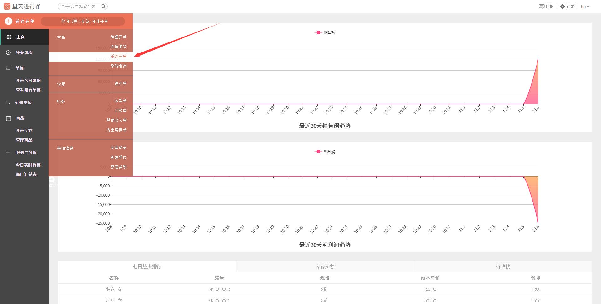

>2、进入**订单/采购开单**界面。

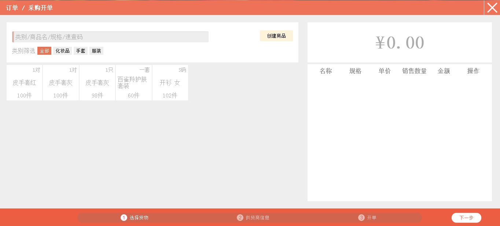

>3、选择销售退货商品。（**注：**如果这里没有目标商品，可点击`创建商品`，可进行创建商品，具体可参照**5.1.1 新建商品**。）

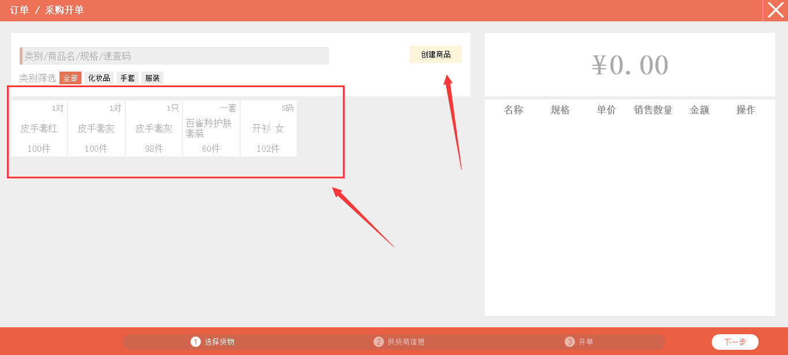

>4、如果商品过多，可用速查码、类别、商品名和规格进行查找~在红色箭头所指的搜索框内输入**速查码**（商品速查码、往来单位速查码都可进行搜索查询），就会弹出对应的商品了哦~~~比如输入“bqlhftz”，就会跳出商品名为“百雀羚护肤套装”的商品。

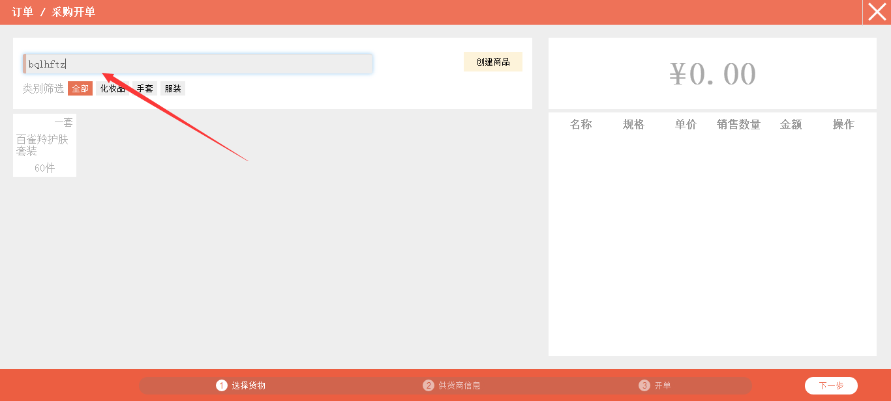

>5、点击选择需要进行采购的商品，在*右侧* 触摸键盘或者系统自带键盘输入采购数量，点击`下一步`。

>6、在*右侧* 触摸键盘或者系统自带键盘输入采购单价，系统会自动计算出“采购金额”，点击`添加`或者`完成`。

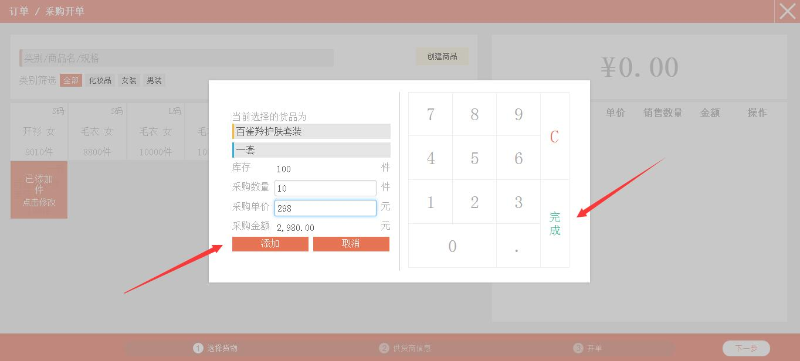

>7、页面*右侧* 会出现添加的商品，可在箭头所指的位置进行更改退货数量以及退货单价，也可进行删除商品。

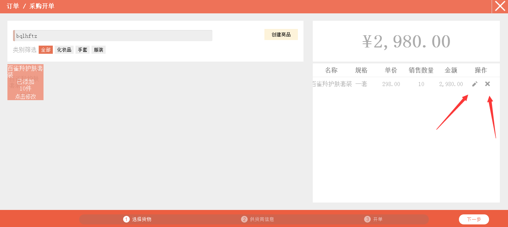

>8、确认无误后，点击`下一步`。

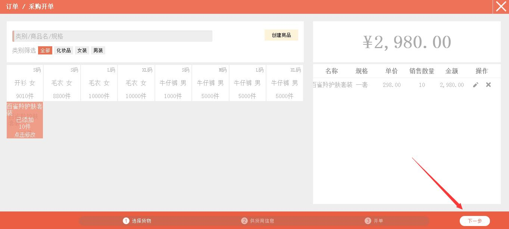

>9、点击红色箭头所指的位置，会跳出您添加过的往来单位。**注：**若是没有您的目标往来单位，可点击`增加新单位`进行添加往来单位，具体可参照**5.3.1 新建单位**。

>10、选择好目标客户后，会跳出该客户的联系人，点击选择目标联系人，会自动跳出该联系人的姓名、电话、车牌号。

>11、点击红色箭头所指的位置，可进行更改选择目标车牌号。

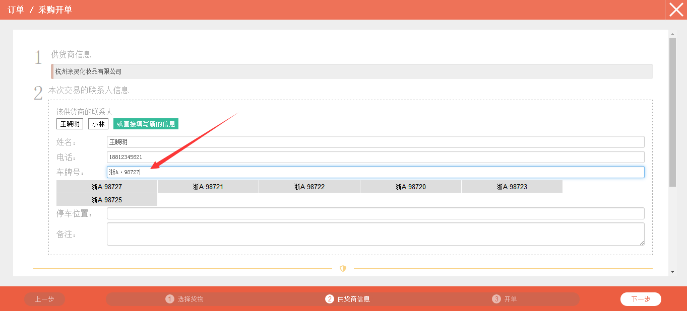

12、点击红色箭头所指的位置，选择目标停车位置。可根据实际情况填写“备注”，可填可不填。

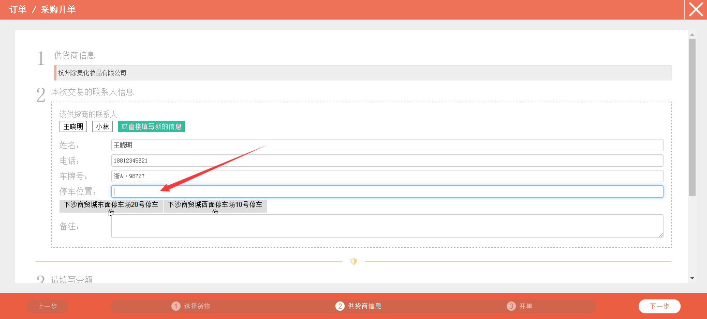
>13、若通过网络、现金或者银行收到了对方的账款，在红色框内填写相应的金额。若是给了对方优惠，在优惠金额框内填写优惠金额。

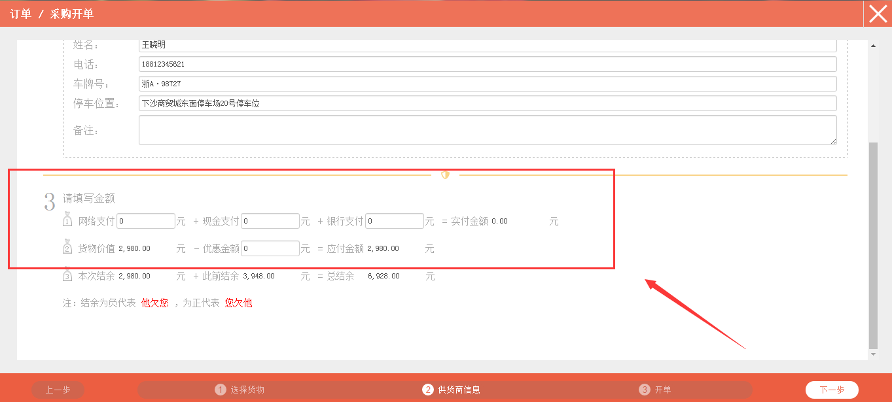

>14、填写无误后，点击右下角的`下一步`。

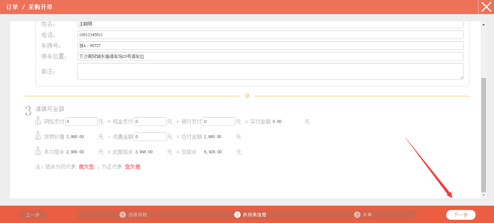

>15、销售开单中包含了联系人信息、备注信息、支付信息以及商品信息，您可根据自身需要是否立即通知库管进行处理。**注：**暂不通知库管处理，意思是开完这笔单子后，系统不会提示库管处理，库管不能查看该笔订单；立即通知库管处理，意思是开完这笔单子后，系统会立即提示库管处理。

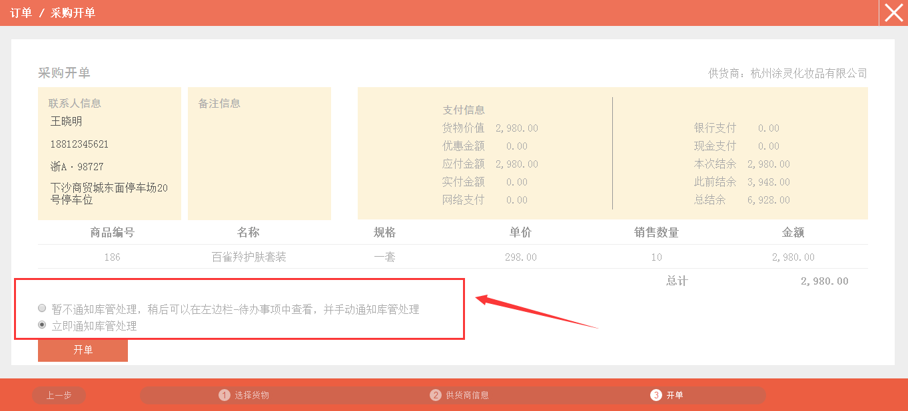

>16、确认无误后，点击`开单`。

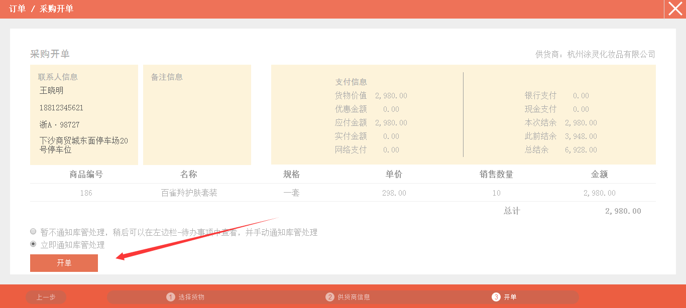

>17、页面跳转到**查看今日单据**。

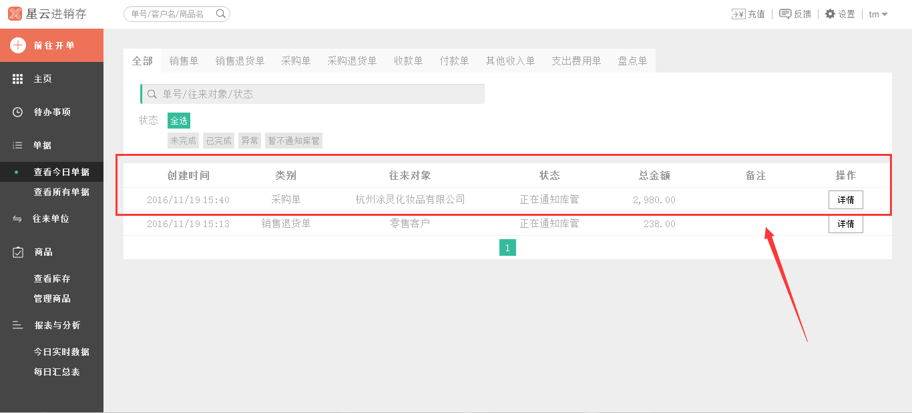

