#4.2.1 盘点单

>**温馨提示：**进入盘点单开单后，会对数据库数据进行锁定，同一时刻就不能新建其他单据了。退出盘点开单或者盘点开单完成后，才会解锁数据库数据。这是为了保证数据不出错哦~
#  
>1、在左侧菜单点击 `前往开单`，在弹出的菜单中选择`盘点单`。

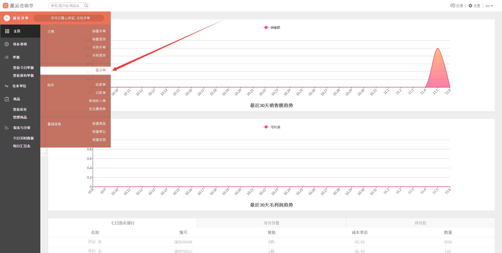

>2、进入**盘点单**界面，弹出框内选择`确定`，

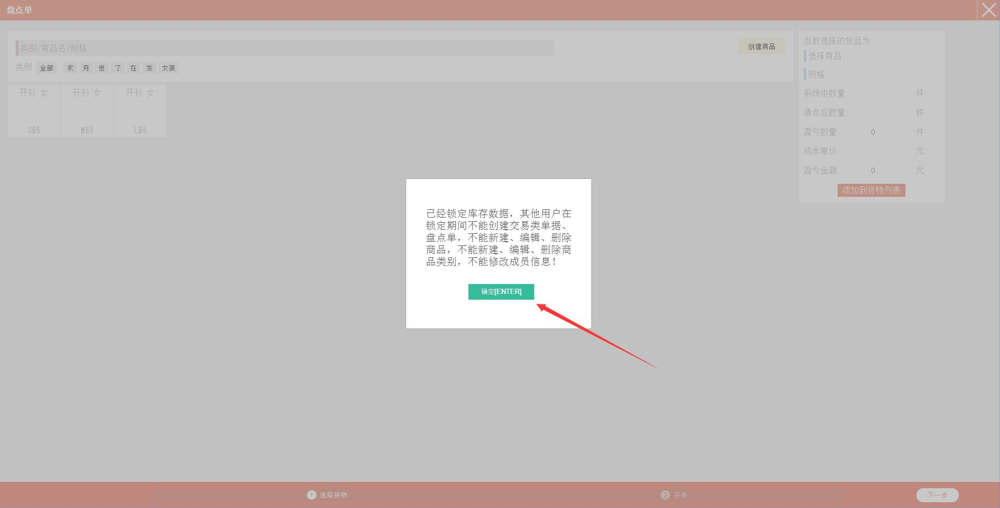

>3、选择盘点开单商品。（**注：**如果这里没有目标商品，可点击`创建商品`，可进行创建商品，具体可参照**5.1.1 新建商品**。）

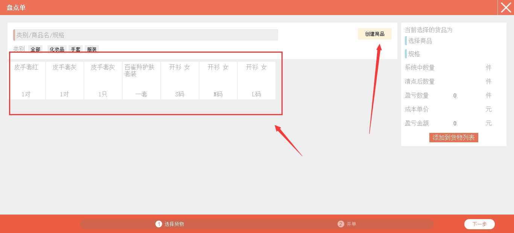

>4、如果商品过多，可用速查码、类别、商品名和规格进行查找~在红色箭头所指的搜索框内输入**速查码**（商品速查码、往来单位速查码都可进行搜索查询），就会弹出对应的商品了哦~~~比如输入“ksn”，就会跳出商品名为“开衫 女”的商品。

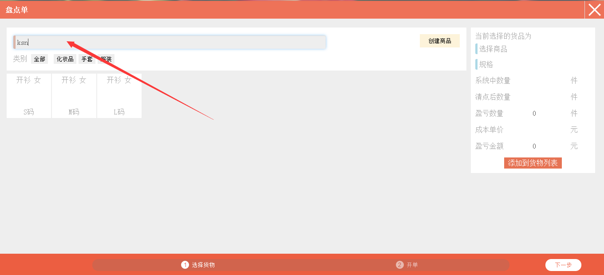

>5、选中要盘点的商品，在*右侧* 触摸键盘或者系统自带键盘输入清点库存后的数量。

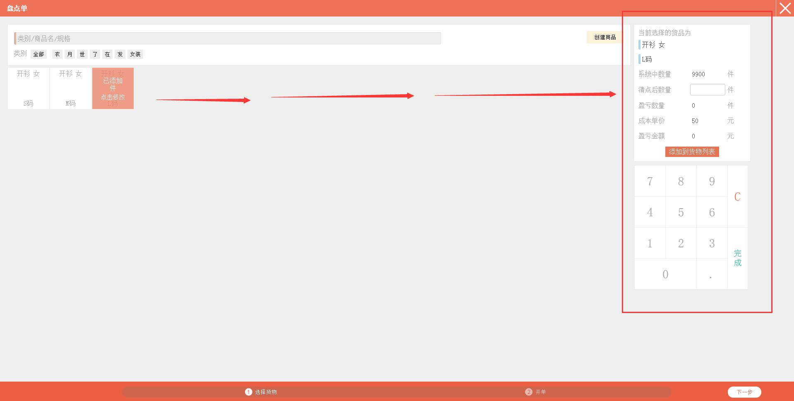

>6、输入清点后的数量，系统会自动计算出您的“盈亏数量”以及“盈亏金额”。

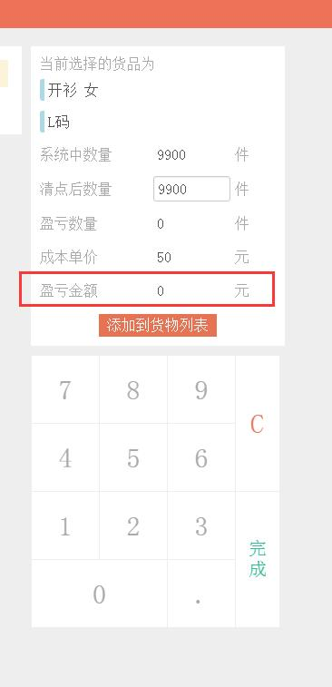

>7、点击 *右侧* 的 `添加到货物列表`，*左侧* 的商品会显示“已添加XXXX”。

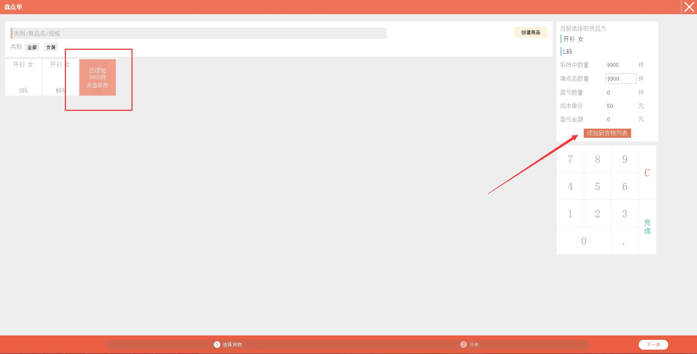

>8、点击右下角的 `下一步`。

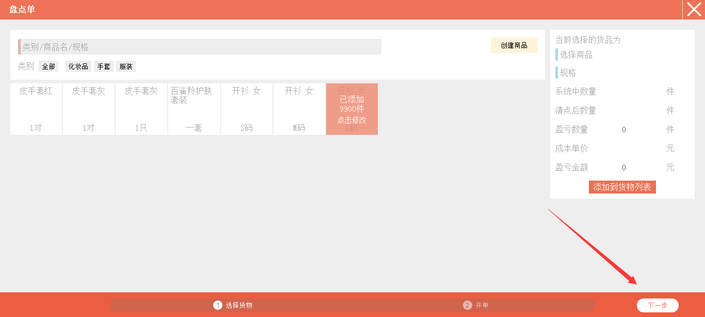

>9、选择盘点人、添加备注（备注可添加也可不添加）。**注：**执行人，是指开这个盘点单的人；盘点人，是指负责盘点商品库存的人。

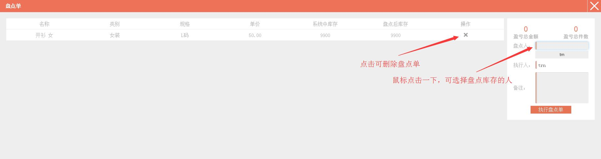

>10、然后点击`执行盘点单`。

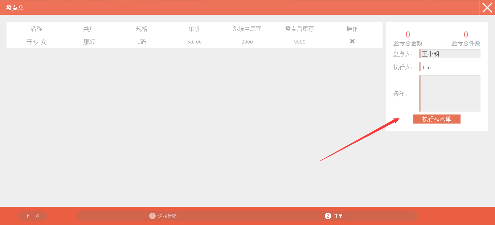

>10、系统提示“商店已解锁”，跳转到**查看今日单据**。

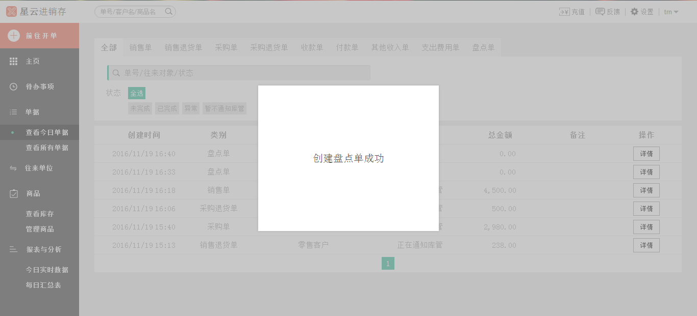

