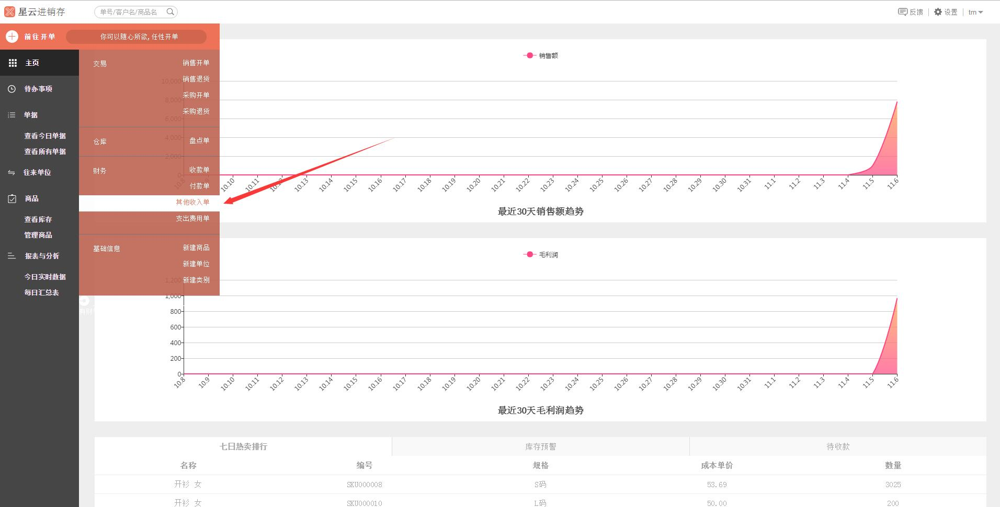
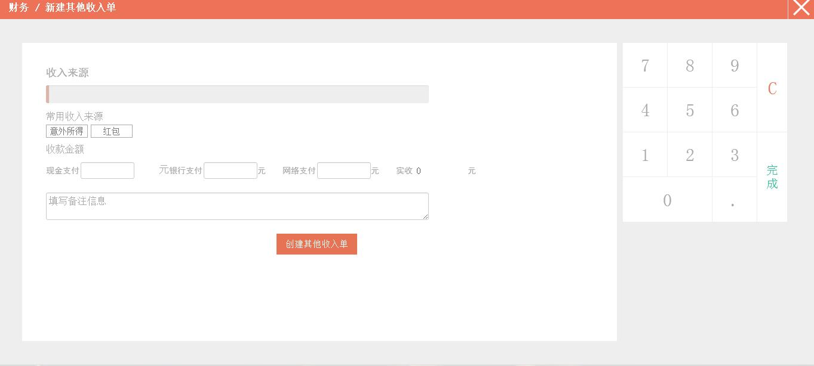
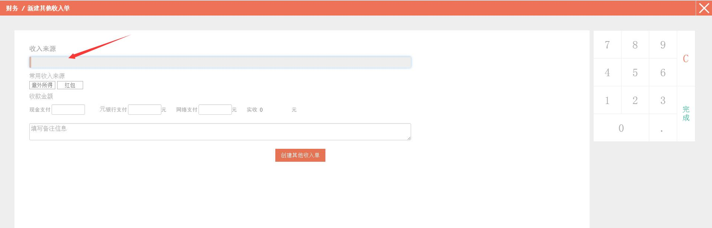
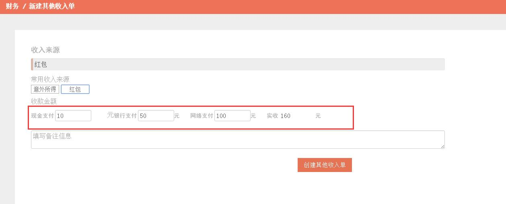
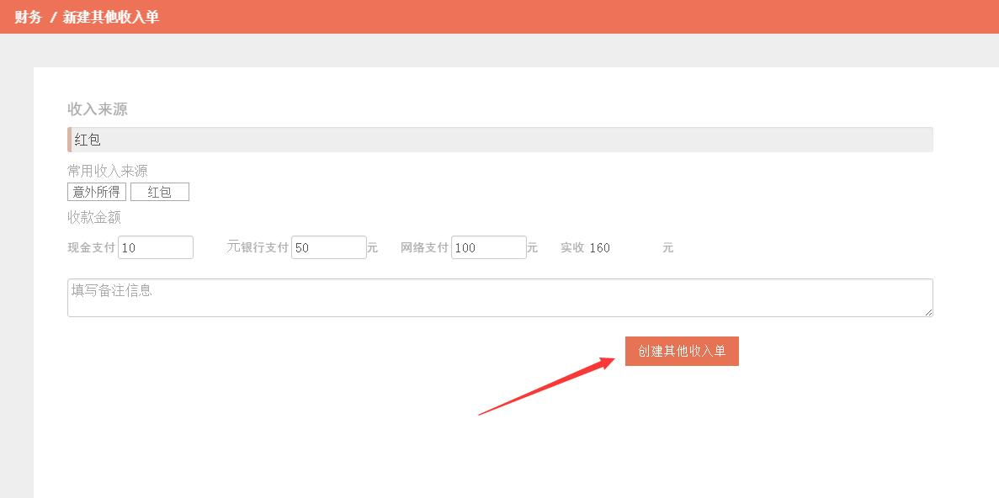
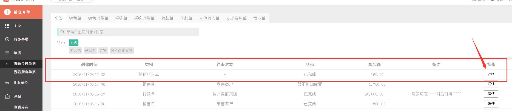

#4.3.3 其他收入单

	
>1、在*左侧* 菜单点击 `前往开单`，在弹出的菜单中选择`其他收款单`。

>2、进入新建**财务/新建其他收入单**界面。

>3、点击红色箭头所指的位置可填写“收入来源”，比如常用收入来源：红包收入。

>4、若通过现金、银行和网络收了款，需在相应的单元格填写金额。

>5、填写完成后，点击`创建其他收入单`。

>6、回到**查看今日单据**界面。

