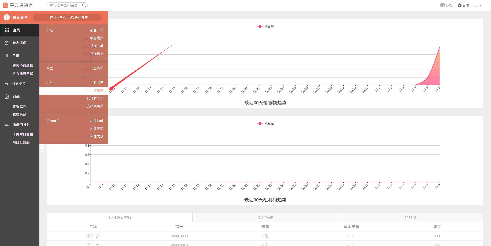
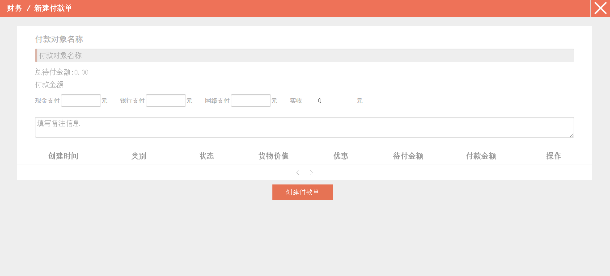
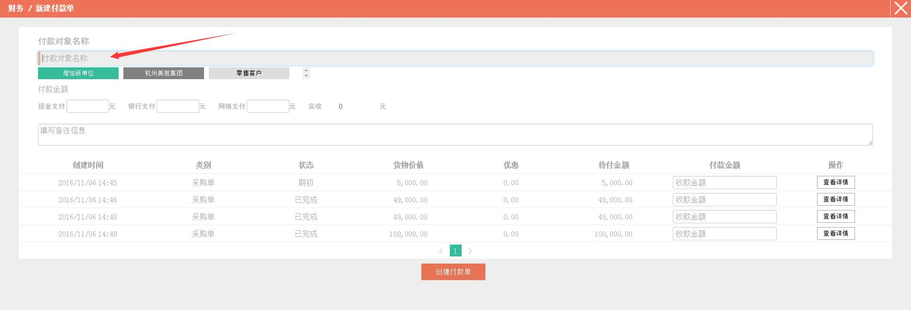
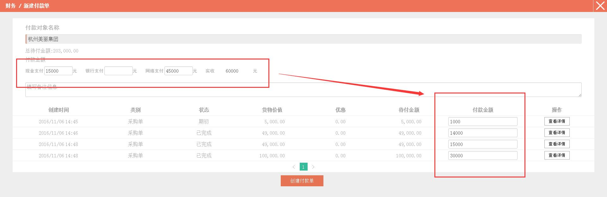
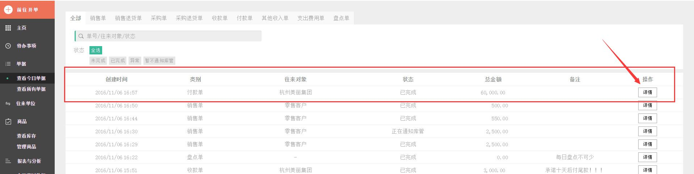

#4.3.2 付款单

	

>1、在*左侧* 菜单点击 `前往开单`，在弹出的菜单中选择`付款单`。

>2、进入**财务/新建付款单**界面。

>3、填写付款对象名称、付款金额以及备注信息。点击红色箭头所指的位置，会跳出几个单位，选择一个您要收款的对象单位。

>4、选择了对象单位后，就会跳出您欠该单位的钱款，若是您通过现金、银行或者网络向该单位付了钱款，您需要在相应的单元格内输入金额。**注：**这里的 “**实收金额**”  必须要等于下方的  “**收款金额**” 一栏的金额，不然付款单是创建不成功的。

>5、点击`创建收款单`，界面跳转到**查看今日单据**。 

