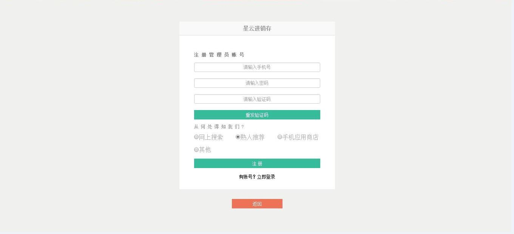

#1.注册登录

	- 注册
	- 登录
		- 管理员登录
		- 员工登录
###注册
>1、 如果你是 ***管理员*** ，第一次登录需进行注册，点击红色箭头所指的地方进行注册。

>2、填写注册信息，点击`注册`按钮，完成注册即可[登录](http://app.xingyunbooks.com/#/Dashboard "登录")。

###登录
>1、如果你是 ***管理员*** ，点击选择`管理员登录`。

>2、直接输入您注册的手机号码和密码，即可[登录](http://www.xingyunbooks.com/app/#/Dashboard "登录")。

> 3、如果你是 ***员工*** ，点击选择`员工登录`。

>4、直接输入您公司的名称、手机号码和密码（这里的手机号码和密码都是由管理员给出），即可[登录](http://app.xingyunbooks.com/#/Dashboard "登录")。

>5、登录进入界面后，若是想要**退出登录**，点击右上角的用户名，点击`退出登录`，即可返回[登录](http://app.xingyunbooks.com/#/Dashboard "登录")页面。

