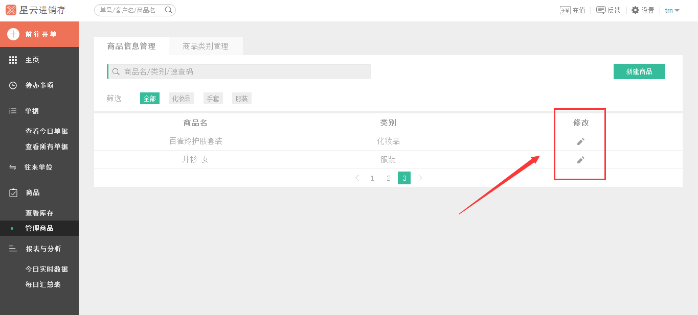
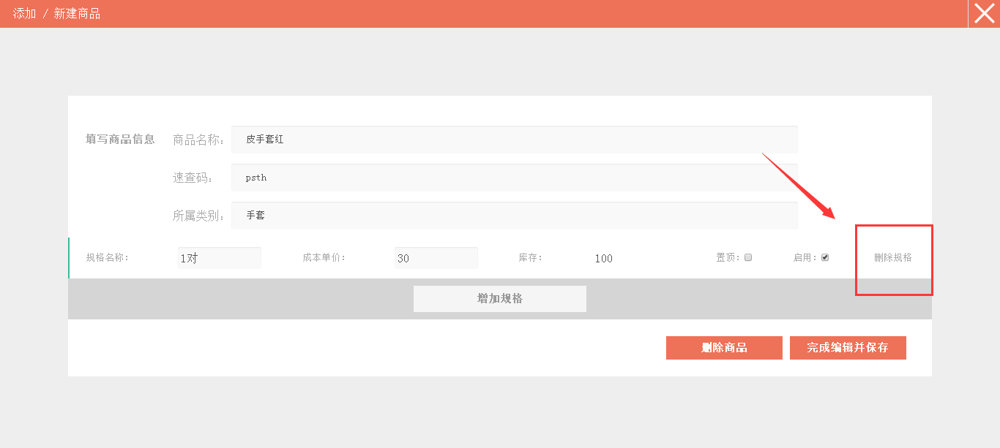
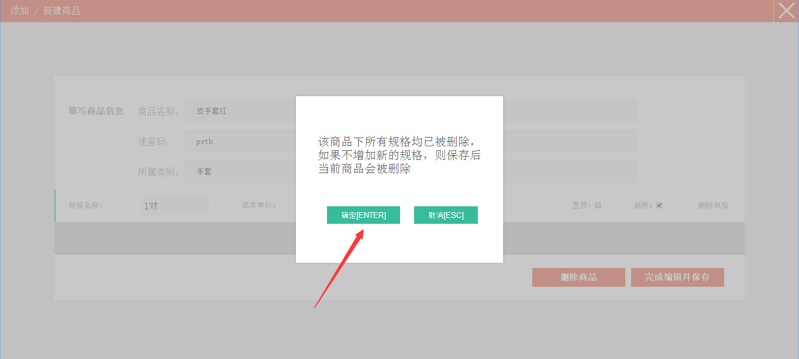
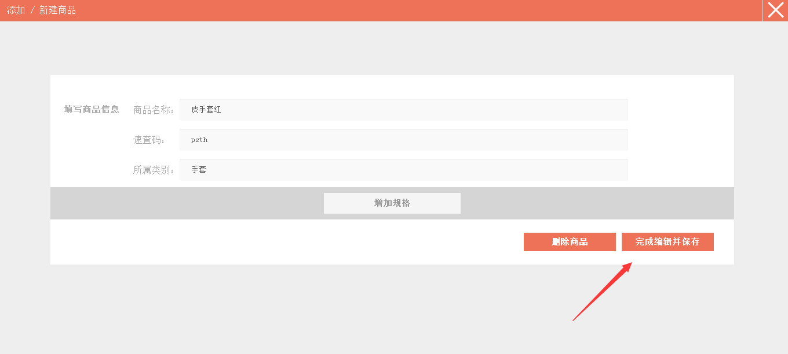
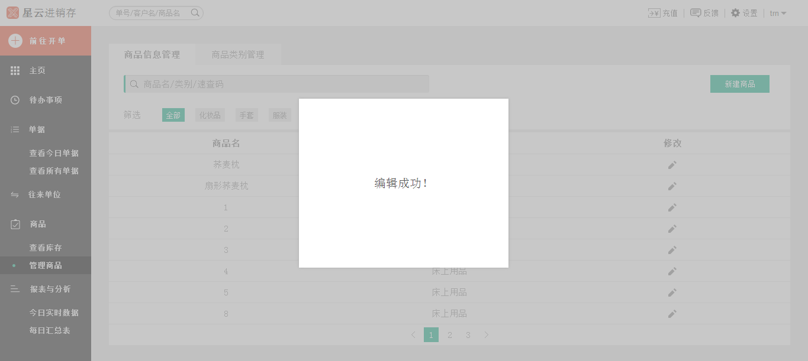

#5.1.2 删除商品

>**温馨提示：**
>**1、如果商品已经有过往来交易，那么就不能删除商品以及商品规格。**
>**2、如果您把商品的规格全都删除了的话，那么这个商品也就自动删除了。也就是说在没有往来交易的前提下，您需要把商品规格全部删除后，即删除了该商品。**

# 

>1、点击*左侧* 的`管理商品`。

>2、进入**商品信息管理**界面。

>3、点击页面右侧的`修改`按钮可以进入到商品修改页面。

>4、如若不想要该商品的信息，可以按页面*右侧* 按钮`删除规格`，进行删除。

>5、点击`删除规格`后，提示框跳出，点击`确定`按钮。

>6、这样规格就删除完了，然后点击页面下方*右侧* 的`完成编辑并保存`按钮。

>7、该商品就被删除了。

