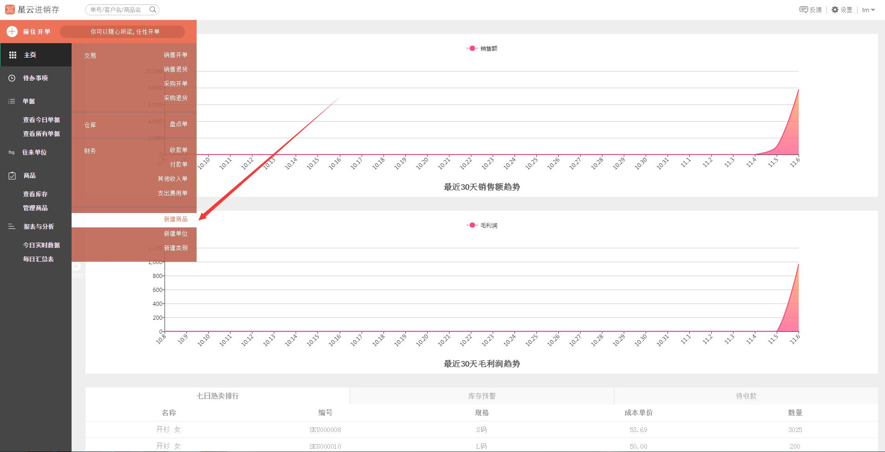
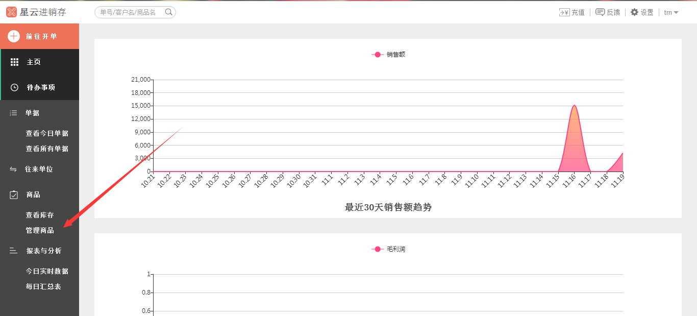
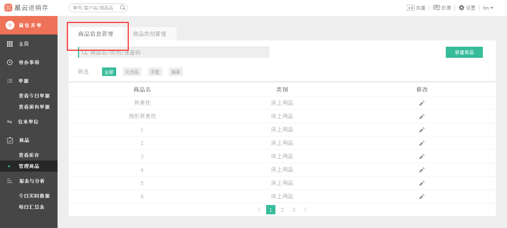
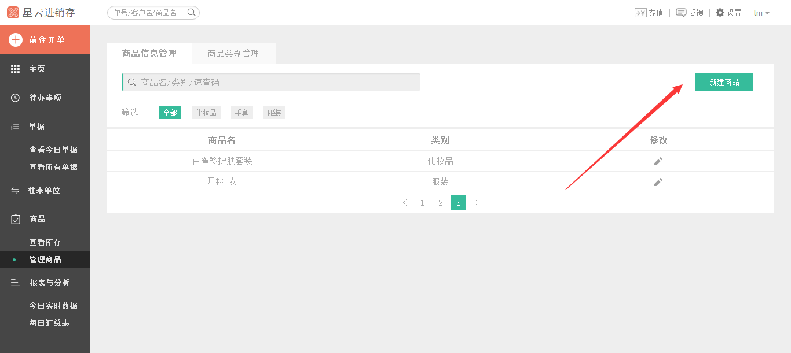
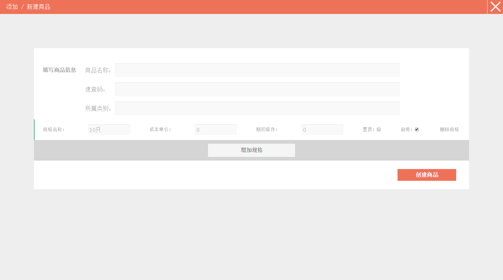
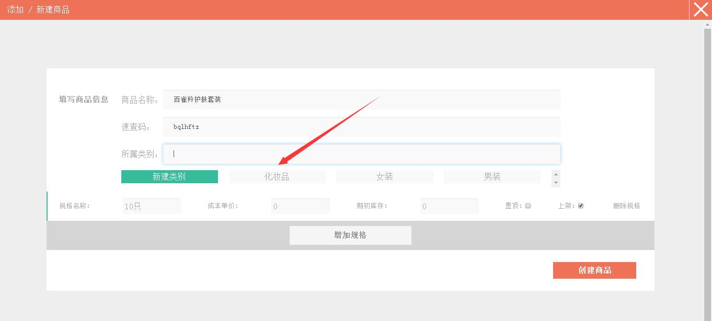
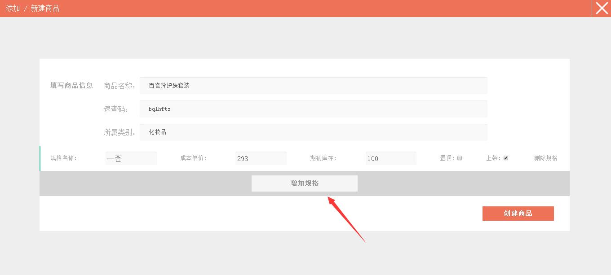
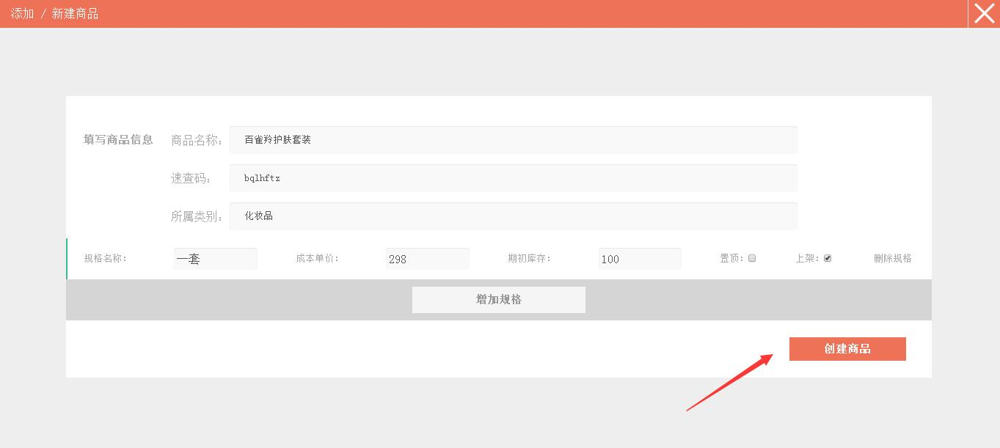
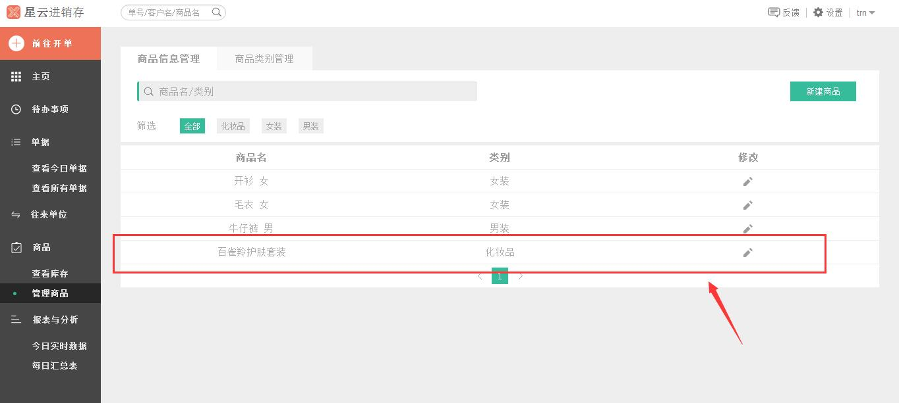

#5.1.1 新建商品

	- “新增商品”入口一
		* `前往开单`——`新建商品`
	- “新增商品”入口二
		* `管理商品`——`商品信息管理`——`新建商品`
	

>**温馨提示：销售开单、销售退货、采购开单、采购退货和盘点单中均可进行新增商品。**以下是单独可进入新建商品的两个入口，如果已经在**添加/新建商品**页面，可`直接点我`。

###“新增商品”入口一

>点击*左侧* 的`前往开单`，在弹出的列表中选中`新建商品`。

###“新增商品”入口二
>1、点击*左侧* 的`管理商品`。

>2、进入**商品信息管理**界面。

>3、点击`新建商品`。

# 
.................................................................................................................................................................................
>1、进入**添加/新建商品**界面，填写商品信息。填写了“商品名称”后，速查码会自动生成（**注：** 速查码是将输入的的商品名称的首写字母提取出来组成的，因为有多音字的情况，当您输入商品名称后，速查码可能会有很多个，比如商品名称为“重金属 铝”，那么它的速查码就是`zjsl`、`cjsl`、`zjzl`或者`cjsl`。速查码可以在搜索栏中输入查找对应的商品）。

	 *举个例子*
	- 商品名称：百雀羚护肤套装
	- 速查码（自动生成）：bqlhftz
	- 规格名称：一套
	- 成本单价：298
	- 期初库存：100

>2、选择“所属类别”，选择该商品的所属类别。**注：**如果这里没有该商品的所属类别，可点击`新建类别`进行新建类别，具体操作可参照**5.2.1 新建类别**。

>3、填写商品“规格名称”、“成本单价”和“期初库存”，选择是否“置顶”，是否“上架”。

>4、如果商品规格很多，那您可以点击`增加规格`，进行增加规格名称、成本单价等信息。

>5、完成编辑后，点击`创建商品`。

>6、界面跳转到**商品信息管理**界面，新增了刚刚创建的商品。

