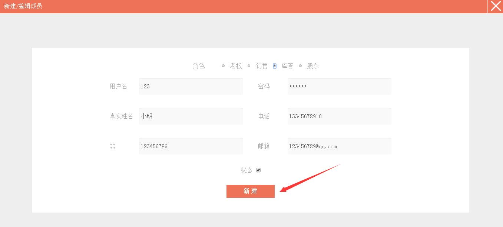

#5.4.1 新建成员

>1、点击右上方的`设置`菜单，在下拉菜单中选中`成员管理`，进入**成员管理**界面。

>2、点击`新增成员`可以新增并设置成员的角色、用户名、密码、真实姓名、电话、QQ和邮箱。**注：**这里的状态勾选上，该成员才能登录系统进行操作。

>3、完成编辑后，点击`新建`。

>**温馨提示：**管理员新增成员时，设置的成员密码、用户名是该成员 **[员工登录](http://www.xingyunbooks.com/#/ManageUser "员工登录")** 星云进销存系统时用的用户名和密码。