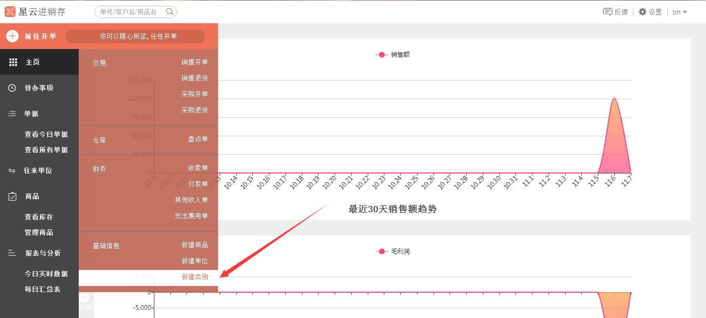
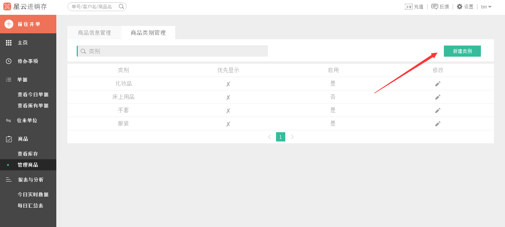
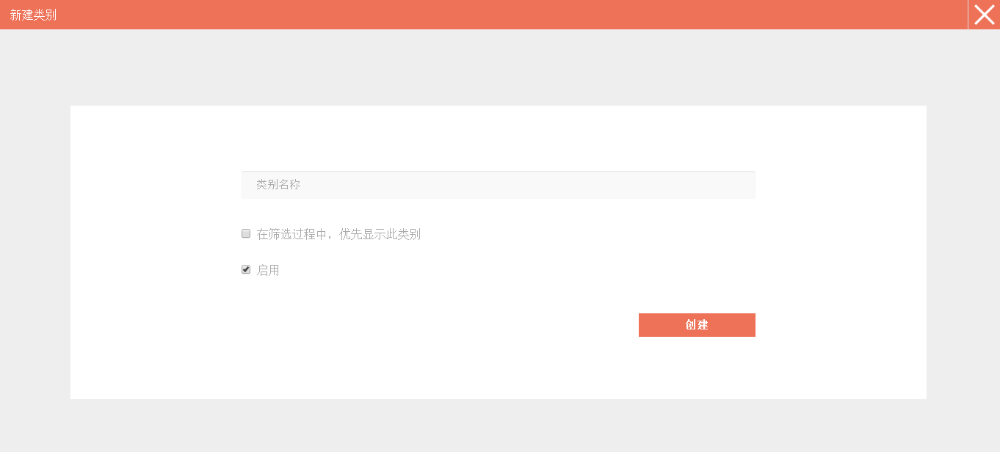
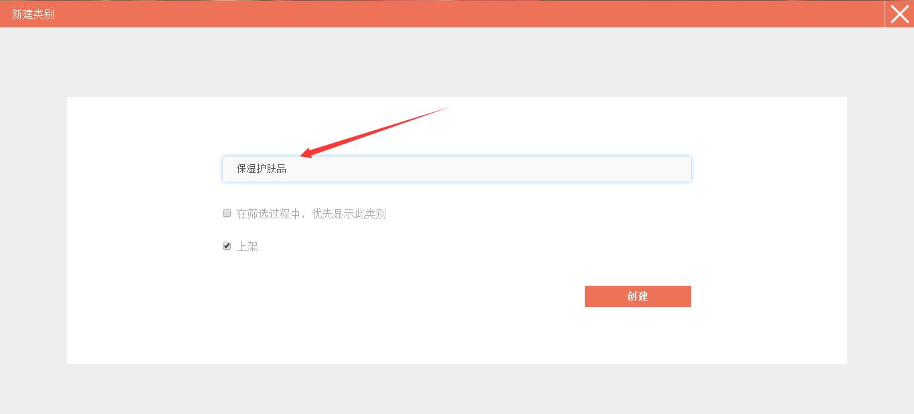
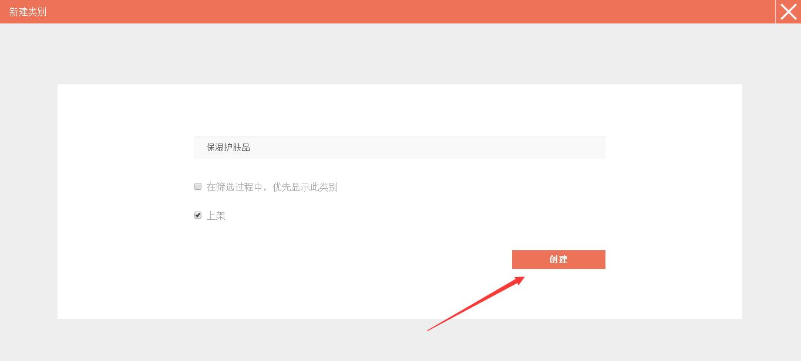

#5.2.1 新建类别
	- “新增类别”入口一
		* `前往开单`——`新建类别`
	- “新增类别”入口二
		* `管理商品`——`商品类别管理`——`新建类别`

>**温馨提示：销售开单、销售退货、采购开单、采购退货和盘点单中新增商品时都可进行新建类别。**以下是单独可进入新建类别的两个入口，如果已经在**添加/新建类别**页面，可`直接点我`。
# 

###“新增类别”入口一
>点击*左侧* 的`前往开单`，在弹出的列表中选中`新建类别`。

###“新增类别”入口二

>1、点击*左侧* 的`管理商品`。

>2、点击`商品类别管理`。

>3、点击`新建类别`。

# 
.................................................................................................................................................................................
>1、进入**新建类别**界面.

>2、输入“类别名称”，如保湿护肤品，可根据需要勾选是否在筛选过程中，优先显示此类别和是否上架该类别。（注：只有勾选了上架，设置商品类别为该类别的商品才能上架，以供销售等操作。）

>3、编辑好之后，点击**创建**按钮，即创建成功。

