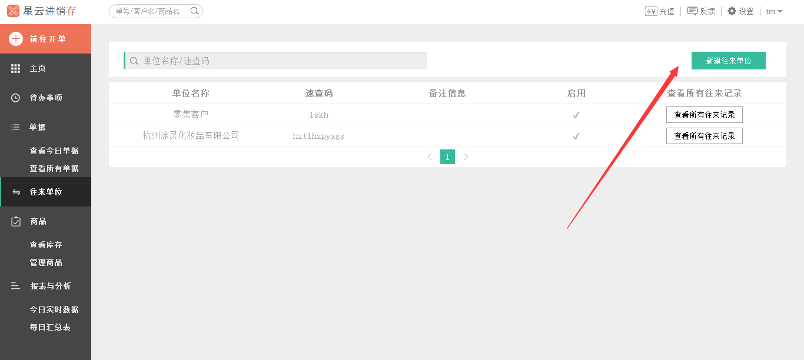
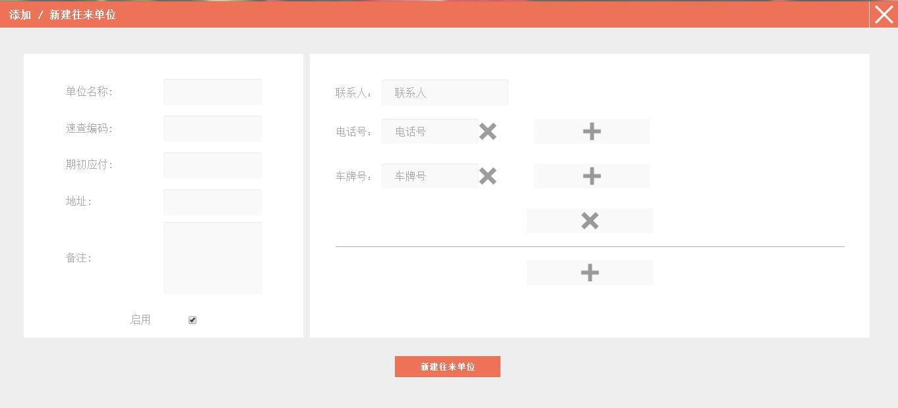
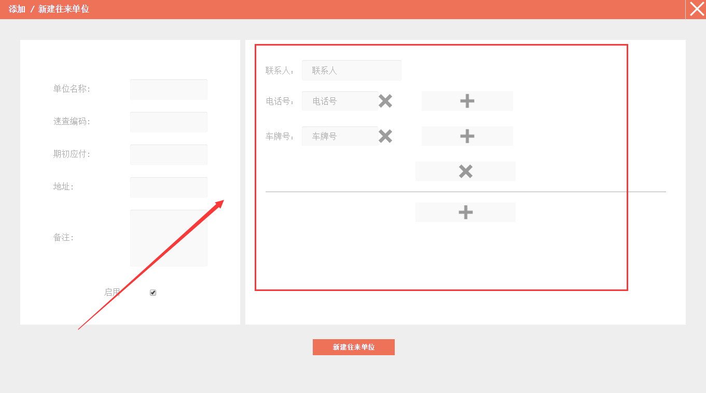
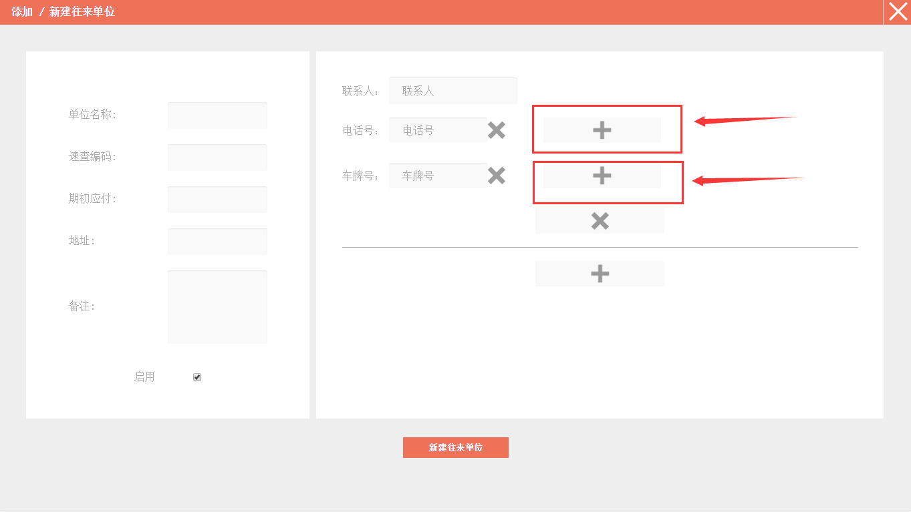
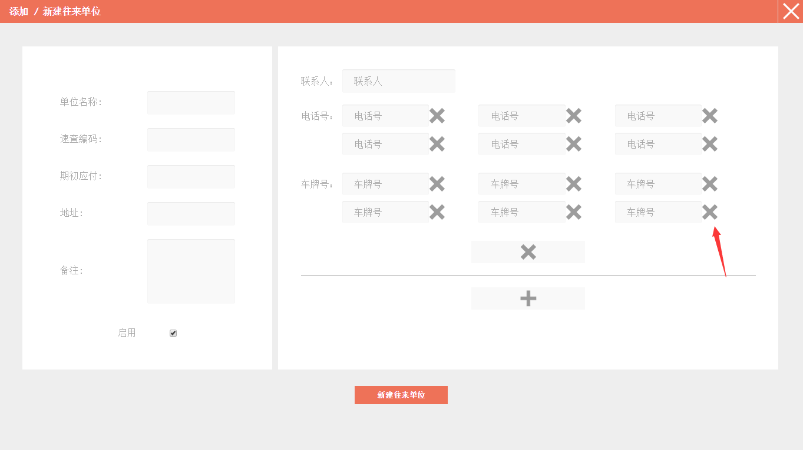
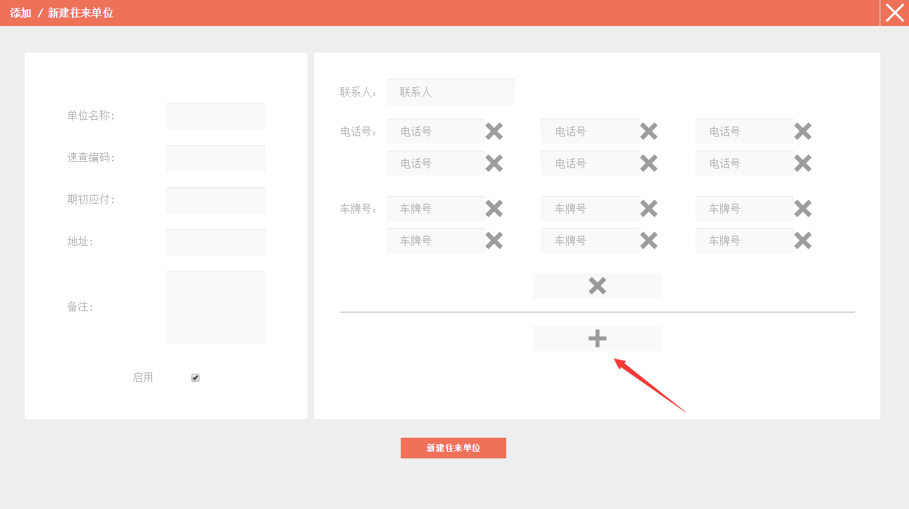
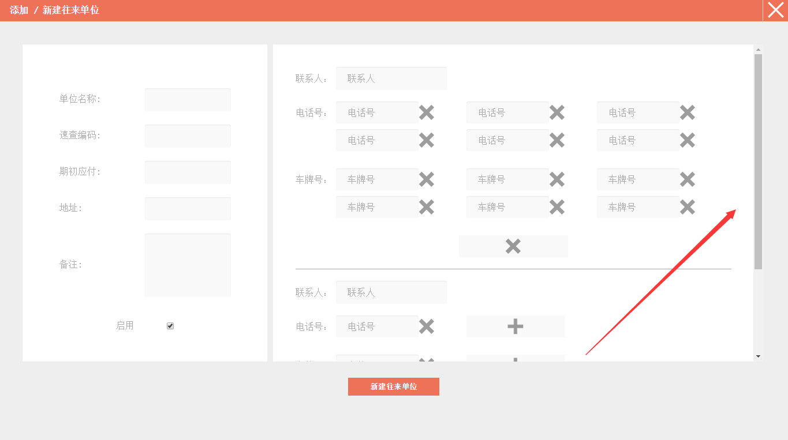
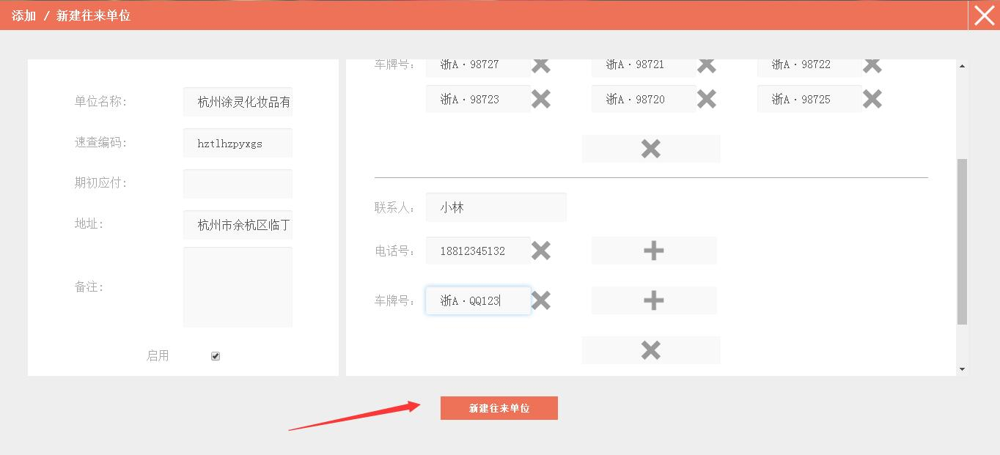
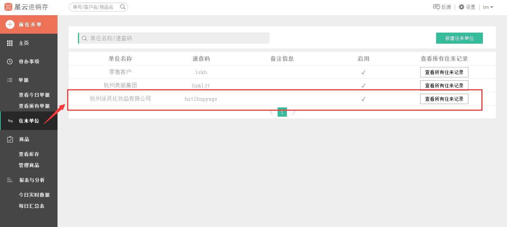

#5.3.1 新建单位

	- “新增单位”入口一
		* `前往开单`——`新建单位`
	- “新增单位”入口二
		* `往来单位`——`新建往来单位`
>**温馨提示：销售开单、销售退货、采购开单、采购退货和盘点单中新增商品时都可进行新建单位。**以下是单独可进入新建单位的两个入口，如果已经在**添加/新建单**页面，可`直接点我`。
# 

###“新增类别”入口一
>点击*左侧* 的`前往开单`，在弹出的列表中选中`新建单位`。

###“新增类别”入口二

>1、点击*左侧* 的`往来单位`。

>2、点击页面右侧的`新建往来单为`。

# 
.................................................................................................................................................................................

>1、进入**添加/新建往来单位**界面。

>2、在*左侧* 填写往来单位信息，包括单位名称，速查编码、期初应付、地址以及备注等信息。注：“速查编码”是在输入单位名称后自动生成的，备注可添加也可不添加。

>3、在*右侧* 填写该单位的联系人信息（一个单位最多可添加6个联系人），包括联系人姓名、电话号码和车牌号的信息。注：这里的“联系人”默认生成的是单位名称，可进行更改；一个联系人最多可添加6个电话号码和6个车牌号。

>4、如果要添加号码跟车牌号可点击`十`进行添加。

>5、如果要删除号码跟车牌号可点击`X`进行删除。

>6、如果要添加联系人，可点击红色箭头所指的`十`进行添加。

>7、红色箭头所指的滚动条可下拉添加其他联系人。

	 *举个例子*
	- 单位名称：杭州涂灵化妆品有限公司
	- 速查编码（自动生成）：hztlhzpyxgs
	- 地址：杭州余杭区临丁路111号
	- 勾选“启用”
		- 联系人：王晓明
		- 电话号：18812345621   18812345622  18812345623  18812345624  18812345625  18812345626
		- 车牌号：浙A·98727  浙A·98721  浙A·98722  浙A·98723  浙A·98720  浙A·98725

		- 联系人：小林
		- 电话号：18812345132
		- 车牌号：浙A·QQ123

>8、完成添加后点击`新建往来单位`。

>11、界面跳转到**往来单位**。

