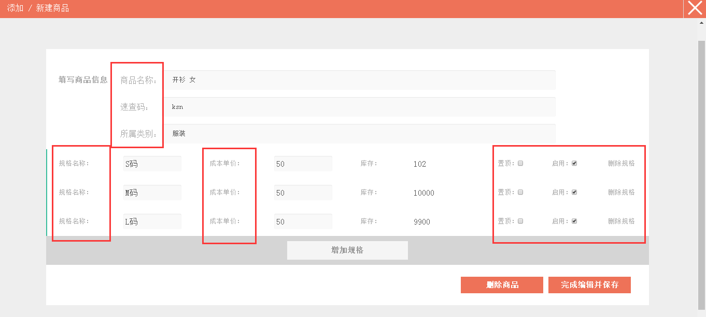
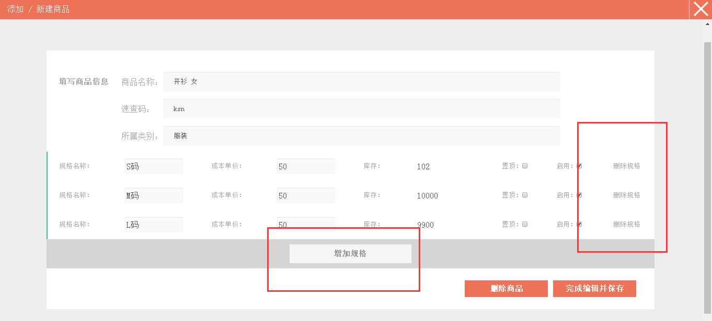
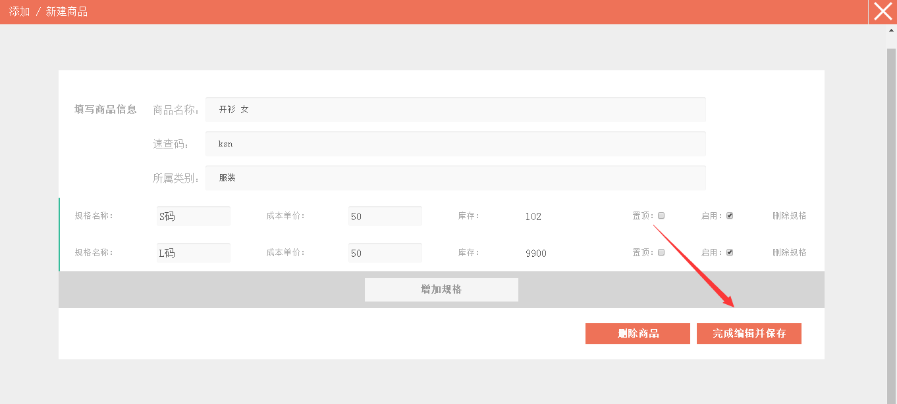
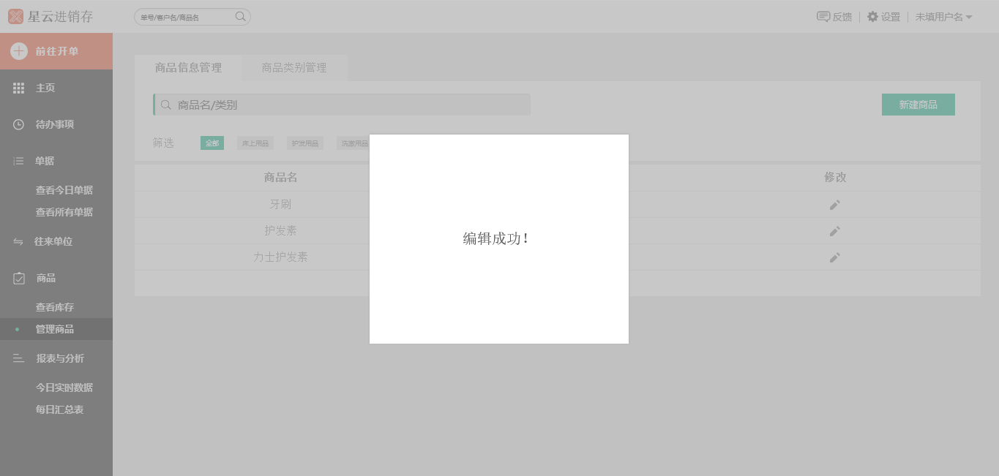

#5.1.3修改商品信息
>1、点击*左侧* 的`管理商品`。

>2、进入**商品信息管理**界面。

>3、点击页面右侧的`修改`按钮可以进入到商品修改页面。

>4、进入修改页面后，可随意修改想要修改的商品信息。**注：**期初库存不能更改。

>5、可增删商品规格。**注：**如果商品已经有过往来交易，那么就不能删除商品规格。

>6、完成修改后，点击右下侧的`完成编辑并保存`的按钮。

>7、即保存商品信息成功。

