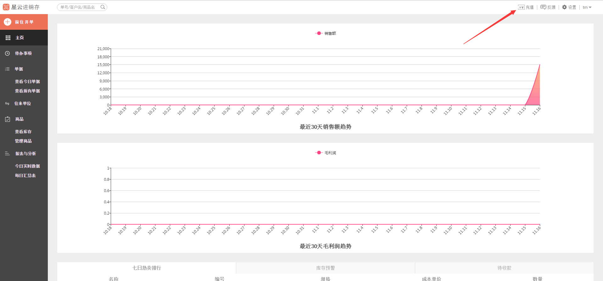
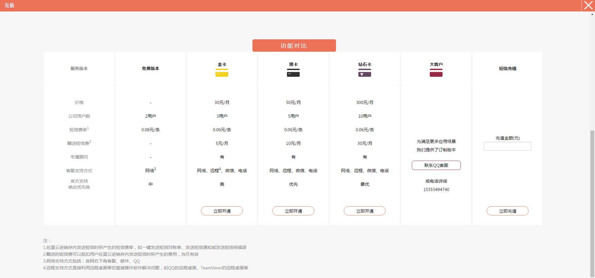
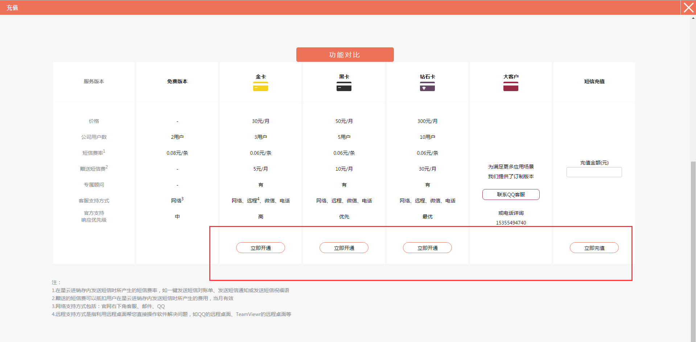
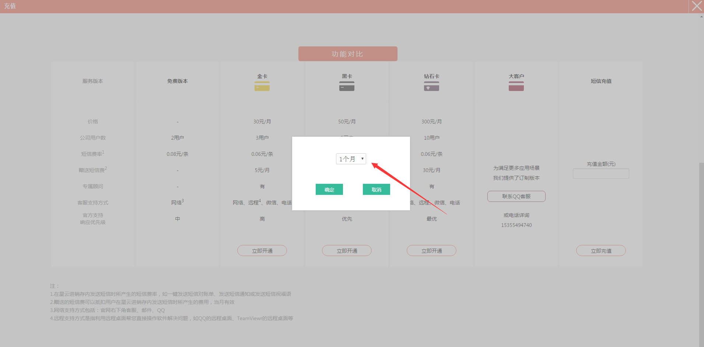
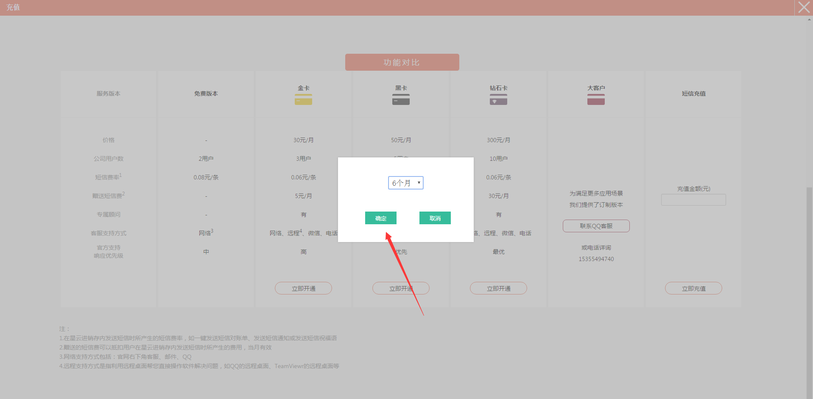
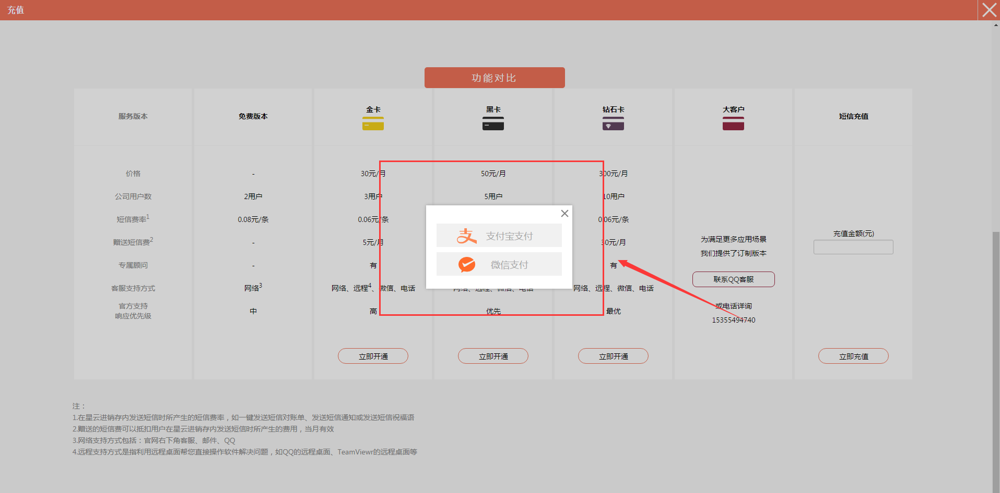
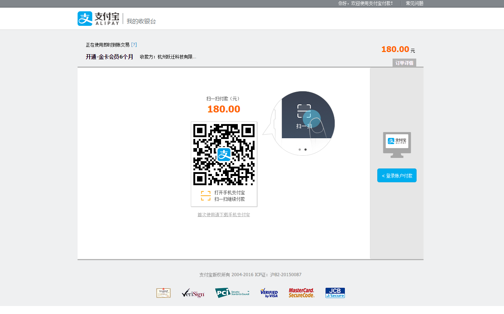
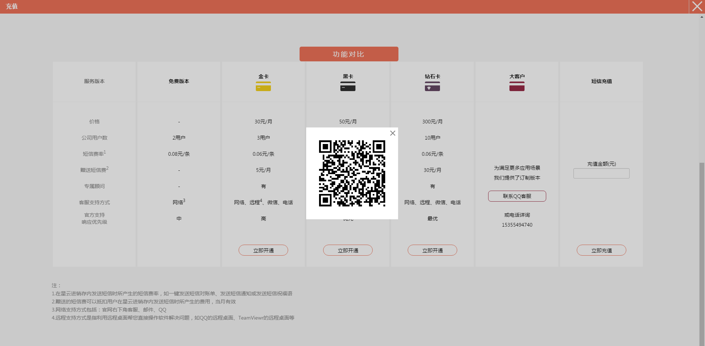
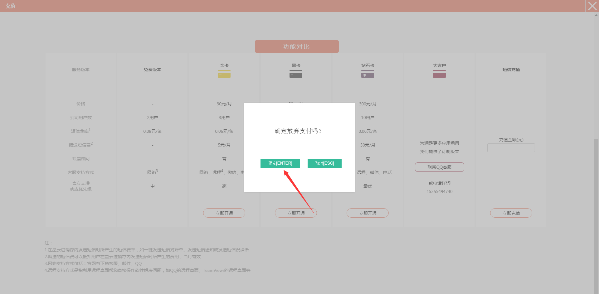

#3. 充值
	-支付宝支付
	-微信支付

> 1、点击右上方的`充值`。

>2、进入**充值**页面。

>3、根据需求选择相应的服务，点击`立即开通`。

>4、点击红色箭头所指的位置，选择想要开通的月数。

>5、选择好月数后，点击`确定`。

>6、选择支付方式。

>7、选择支付宝支付，进入支付宝支付界面，打开手机支付宝扫码进行支付。

>8、选择微信支付，会跳出支付的二维码，打开微信直接扫描二维码进行支付。

>9、如果想要退出，点击`X`，再点击`确定ENTER`按钮，即可退出**充值**页面。

