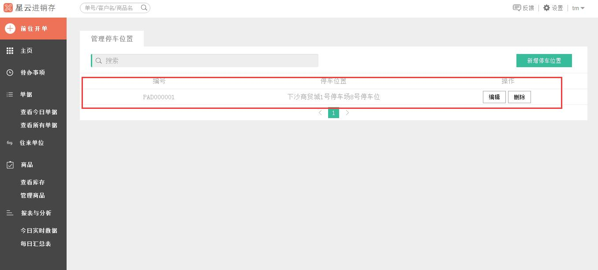

#7、添加停车位置

>1、点击右侧`设置`菜单，在下拉菜单中选中`停车位置`。

>2、进入**停车位置** 的界面。

>3、点击`新增停车位置`可新增货车所停放的停车位，好让库管把货物搬运到货车上。

>4、点击`新建`后，**停车位置** 界面即显示出刚刚编辑的这条停车位置信息。

>5、后面停车位置多了之后还可以在搜索框里输入关键词，进行搜索列表中相应的停车位。

>6、例如，在搜索框中输入“下沙商贸城”，即可从列表中筛选出下沙商贸城的停车位置。

>**温馨提示：****停车位置**一定要写清楚写详细哦~~~不然库管找不到你的货车可就麻烦了呢~