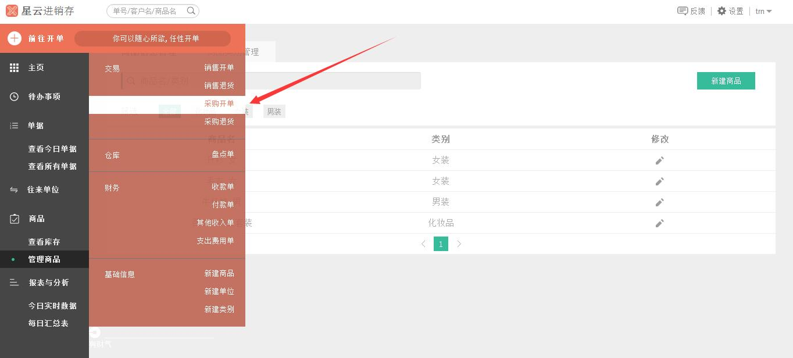
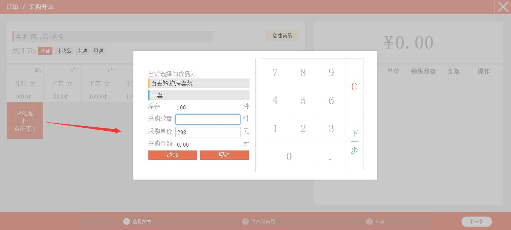
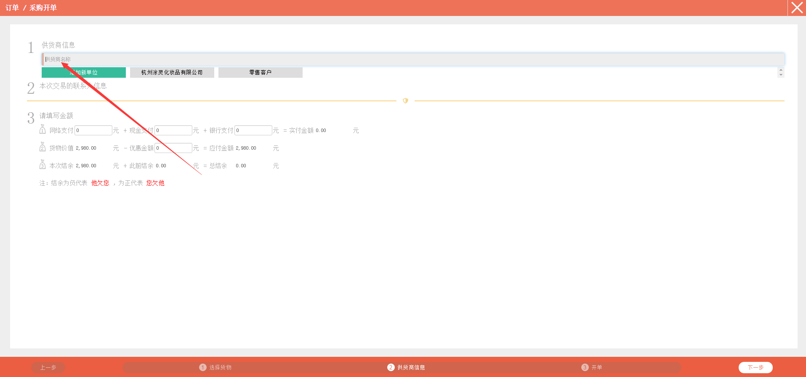
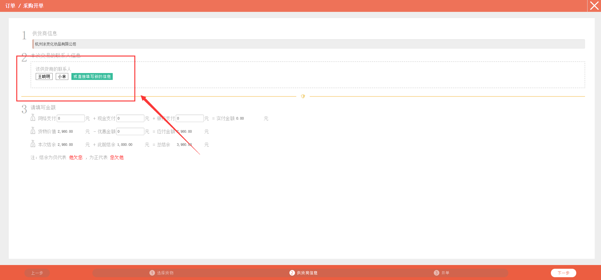
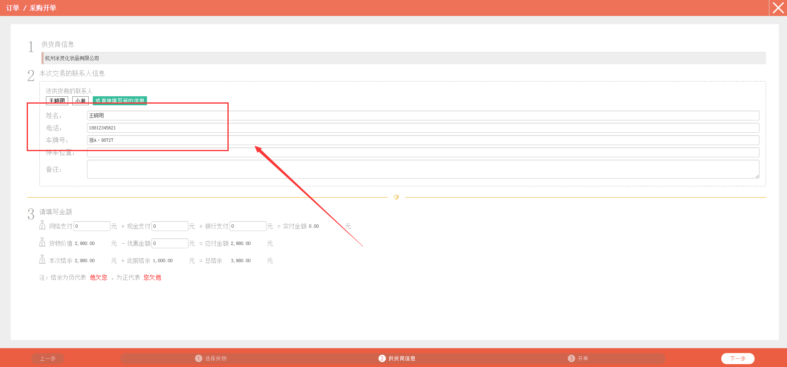
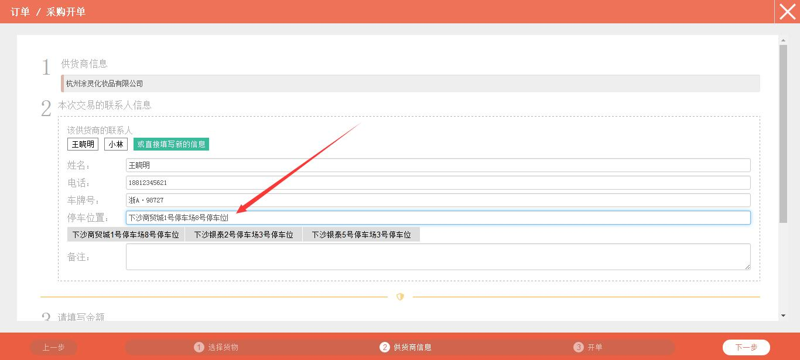
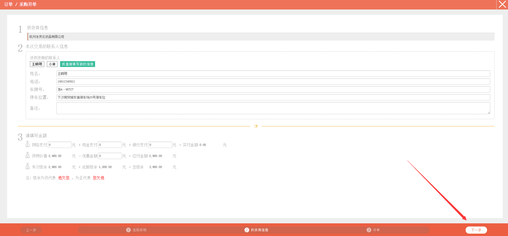
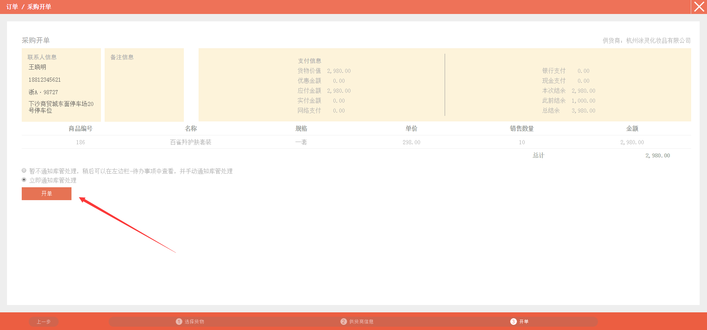
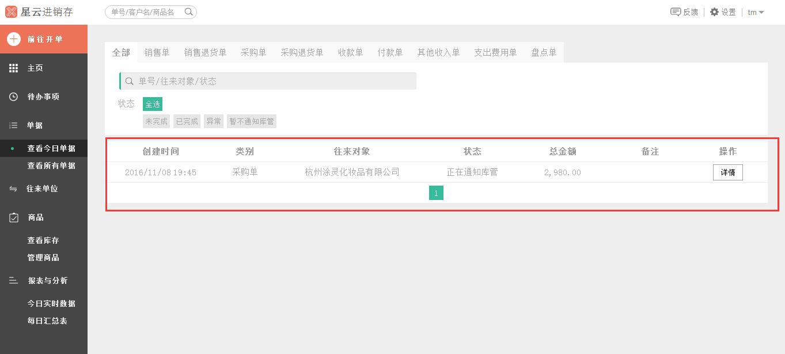

#8. 采购进货

>1、点击*左侧* 的`前往开单`，在弹出的列表中点击`采购开单`。

>2、点击选择需要进行采购的商品，在*右侧* 触摸键盘或者系统自带键盘输入采购数量。

>3、点击`下一步`。

>4、在*右侧* 触摸键盘或者系统自带键盘输入采购单价，系统会自动计算出“采购金额”，点击`添加`或者`完成`。

>5、*右侧* 可查看采购商品信息，点击红色箭头所指可进行修改和删除操作。

>6、完成编辑后点击**下一步**。

>7、点击红色箭头所指的位置，会跳出您添加过的往来单位。**注：**若是没有您的目标往来单位，可点击`增加新单位`进行添加往来单位。

>8、选择点击目标往来单位，会弹出该供货商的联系人。

>9、点击选择目标联系人，会自动跳出该联系人的姓名、电话、车牌号。

>10、鼠标放在红色箭头所指的位置，会跳出该联系人的车牌号，选择目标车牌号。

>11、鼠标放在红色箭头所指的位置，会跳转出添加进来的停车位，选择目标停车位置。

>12、可根据实际情况填写“备注”，可填可不填。

>13、根据实际情况填写网络支付金额、现金支付和银行支付，若没有支付，可不填写。

>14、编辑完成后，点击整个页面右下角的`下一步`。

>15、采购开单中包含了联系人信息、备注信息、支付信息以及商品信息，您可根据自身需要是否立即通知库管进行处理。**注：**暂不通知库管处理，意思是开完这笔单子后，系统不会提示库管处理。

>16、确认无误后，点击`开单`。

>17、页面跳转到**查看今日单据**。

