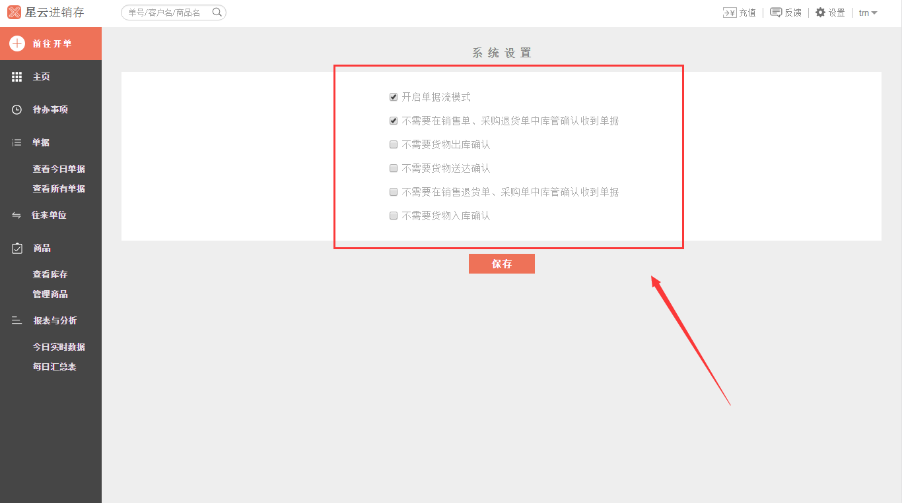

#4、单据流

>1、点击右上角的`设置`菜单，在下拉菜单中选中`系统设置`。

>2、进入**系统设置**界面。

>3、单据流模式（勾选“开启单据流模式”，打开单据流模式）

	- 开启单据流模式
		- 不需要再销售单、采购退货单中库管确认收到单据
		- 不需要货物出库确认
		- 不需要货物送达确认
		- 不需要再销售退货单、采购单中库管确认收到单据
		- 不需要货物入库确认

- **不需要再销售单、采购退货单中库管确认收到单据**

> **意思是：**在开销售单和采购退货单时，库管不需要确认单据，就直接跳入“已确认，未出库”这一步骤。

- **不需要货物出库确认**

> **意思是：**货物在出库的时候，不需要进行确认，就直接跳入“已出库，未送达”这一步骤。

- **不需要货物送达确认**

> **意思是：**货物送达到目的地后，不需要进行确认就直接跳入“完成”这一步骤。

- 不需要再销售退货单、采购单中库管确认收到单据

> **意思是：**在开销售退货单和采购单时，库管不需要确认单据，就直接跳入“已确认，未入库”这一步骤。

- **不需要货物入库确认**

> **意思是：**货物送达到仓库后，不需要进行确认就直接跳入“完成”这一步骤。

# 

>**温馨提示：在开启单据流模式的情况下，勾选跳过您想要跳过的操作。**

比如，开了销售单或者采购退货单时，货物出库流程为：**暂不通知库管  →  正在通知库管  →  库管未确认  →  已确认，未入库  → 已出库，未送达 → 完成** ，勾选了“不需要在销售单、采购退货单中库管确认收到单据”，那么就库管不需要进行确认是否收到销售单、采购退货单的单据，这一流程就跳过了，直接进入 **“已确认，未入库”** 这一步骤。
