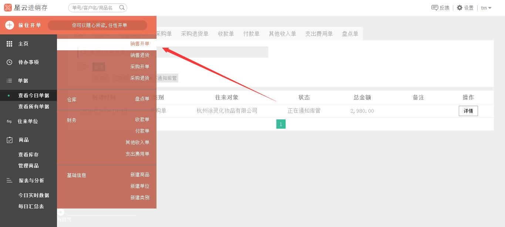
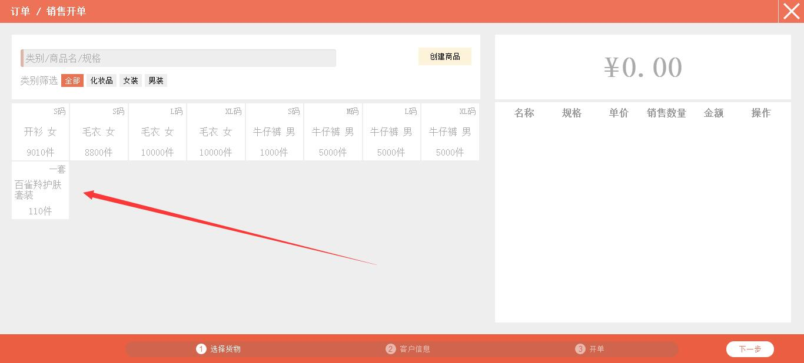
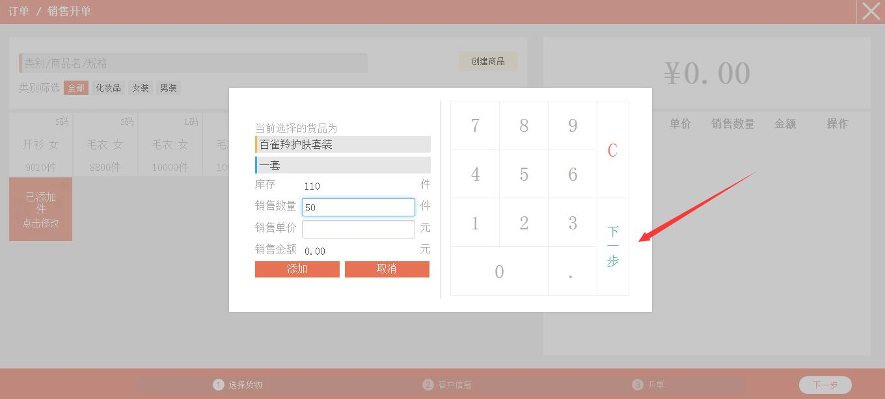
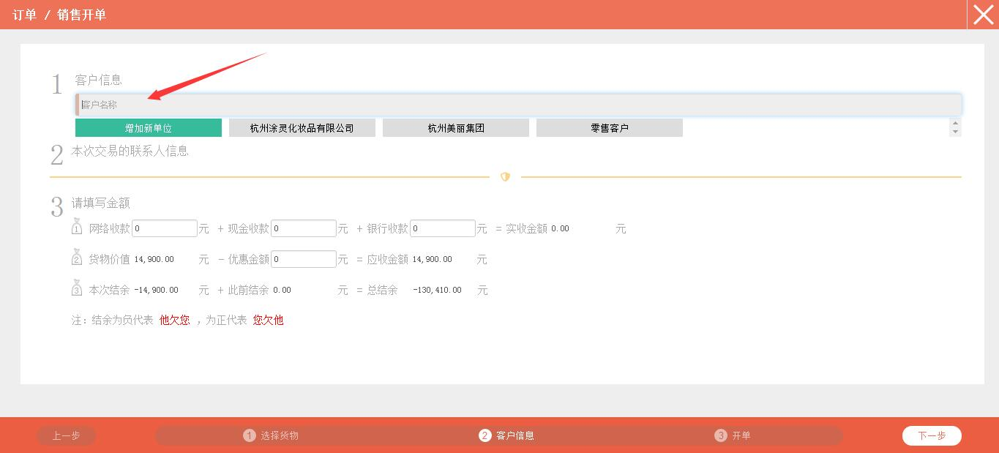
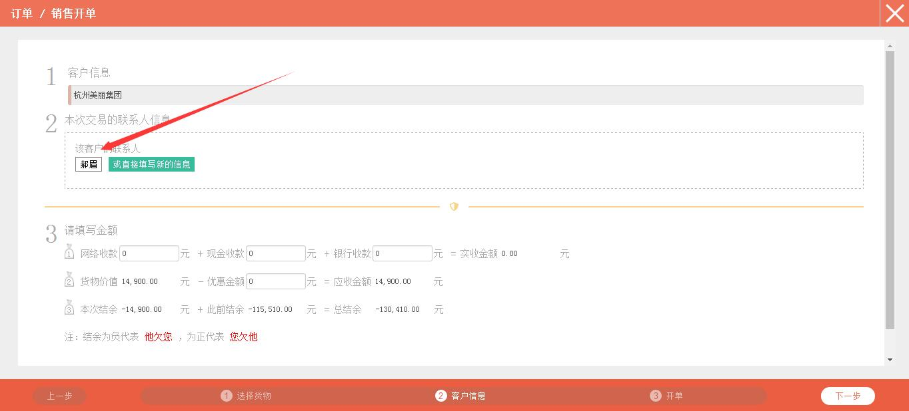
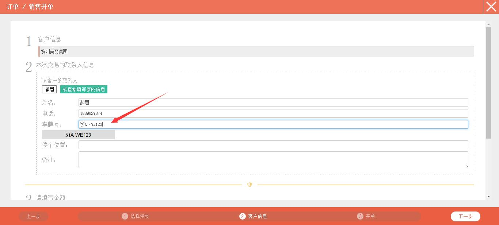
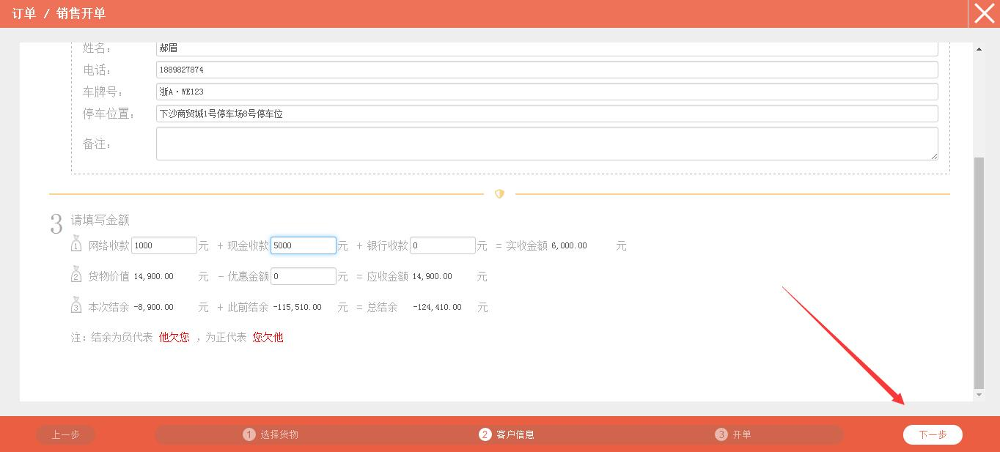
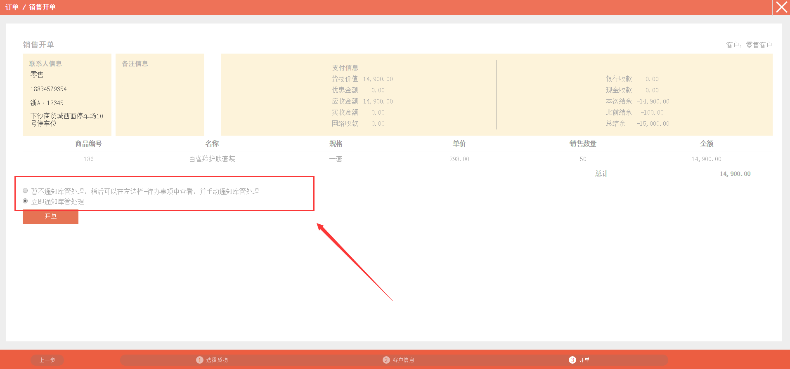
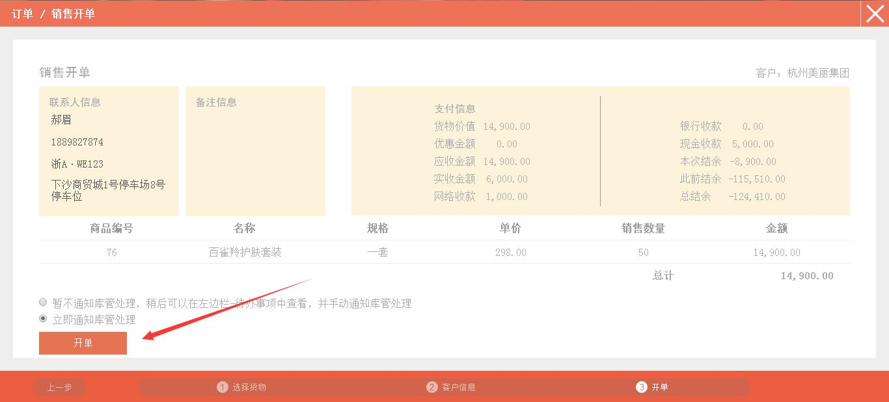

#9. 销售出货

>1、点击左侧的`前往开单`，在弹出的列表中选中`销售开单`。

>2、在这里选择您所要销售的商品。 

>3、点击选择需要开单的商品，弹出的界面包含了您当前选择货品的信息，在*右侧* 触摸键盘或者系统自带键盘输入销售数量后，点击`下一步`。

>4、输入“销售单价”，系统会自动计算出“销售金额”，点击`添加`或者`完成`。

>5、页面*右侧* 会出现添加的商品，可在箭头所指的位置进行更改销售数量以及销售单价，也可进行删除商品。

>6、确认无误后，点击`下一步`。

>7、点击红色箭头所指的位置，会跳出您添加过的往来单位。**注：**若是没有您的目标往来单位，可点击`增加新单位`进行添加往来单位。

>8、选择好目标客户后，会跳出该客户的联系人，点击选择目标联系人，会自动跳出该联系人的姓名、电话、车牌号。

>9、点击红色箭头所指的位置，可进行更改选择目标车牌号。

>10、点击红色箭头所指的位置，选择目标停车位置。可根据实际情况填写“备注”，可填可不填。

>11、若通过网络、现金或者银行收到了对方的账款，在红色框内填写相应的金额。若是给了对方优惠，在优惠金额框内填写优惠金额。

>12、填写无误后，点击右下角的`下一步`。

>13、销售开单中包含了联系人信息、备注信息、支付信息以及商品信息，您可根据自身需要是否立即通知库管进行处理。**注：**暂不通知库管处理，意思是开完这笔单子后，系统不会提示库管处理，库管不能查看该笔订单；立即通知库管处理，意思是开完这笔单子后，系统会立即提示库管处理。

>14、确认无误后，点击`开单`。

>15、页面跳转到**查看今日单据**。

