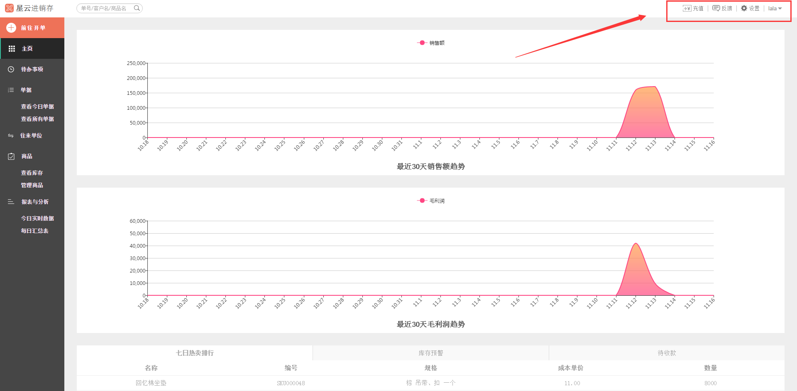
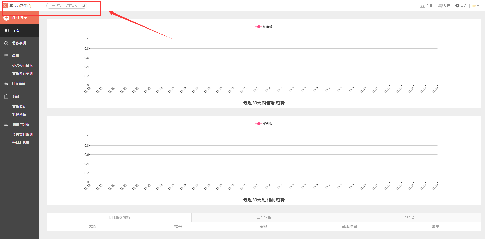
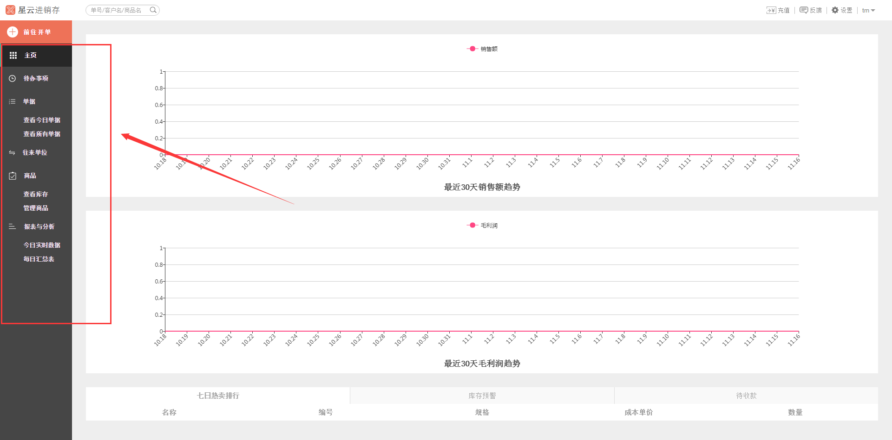
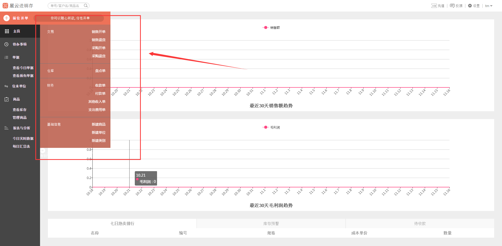
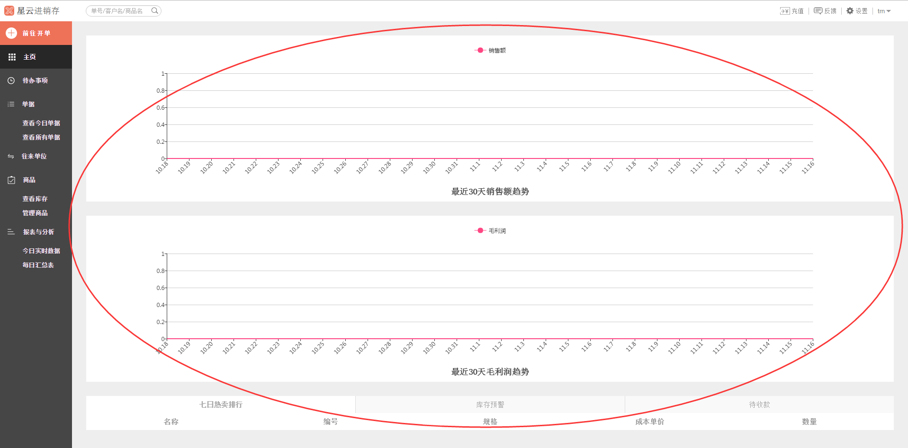

#3、总体布局

>1、页面右上角可以进行一些基本的设置操作，具体如下：

- 充值
- 反馈
- 设置
	- 店铺设置
	- 成员管理
	- 停车位置
	- 系统设置
	- 用户设置
	- 关于
- 退出登录

# 

>2、页面啊左上角点击logo可以进入官网，搜索框内可按单号、客户名和商品名对整个网站添加的数据进行检索。

# 
>3、页面右侧的黑色方块内主要是进行各类单据报表的查询操作以及商品库存等的管理，具体如下：

- 主页（最近30天销售额趋势的查询）
- 待办事项
- 单据
	- 查看今日单据
	- 查看所有单据
- 往来单位查询
- 商品
	- 查看库存
	- 管理商品
- 报表与分析
	- 今日实时数据
	- 每日汇总表

>4、页面右侧的红色方块内的前往开单，主要是新建各种单据以及新建各种商品、类别、单位，具体如下：

- 交易
	- 销售开单
	- 销售退货
	- 采购开单
	- 采购退货
- 仓库
	- 盘点单
- 财务
	- 收款单
	- 付款单
	- 其他收入单
	- 支出费用单
- 基础信息
	- 新建商品
	- 新建单位
	- 新建类别

>5、页面中间部分是展示部分，所有查询结果、操作等都是在这里显示。

>**温馨提示：具体操作可在右侧目录进行具体查看。**