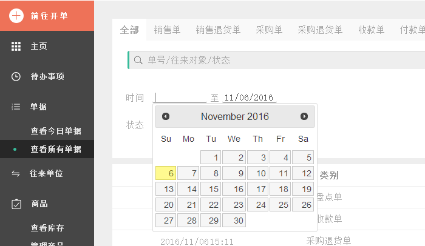
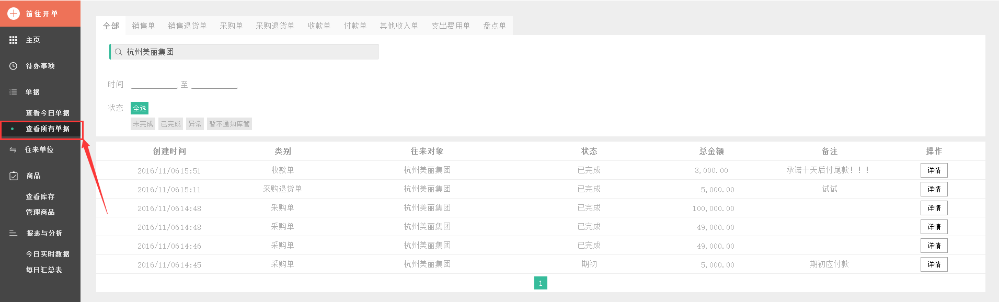
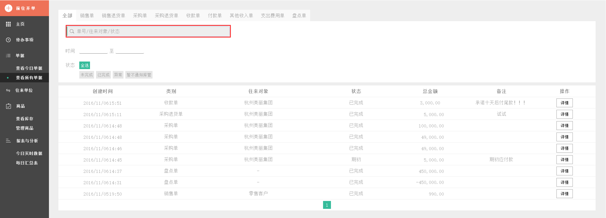
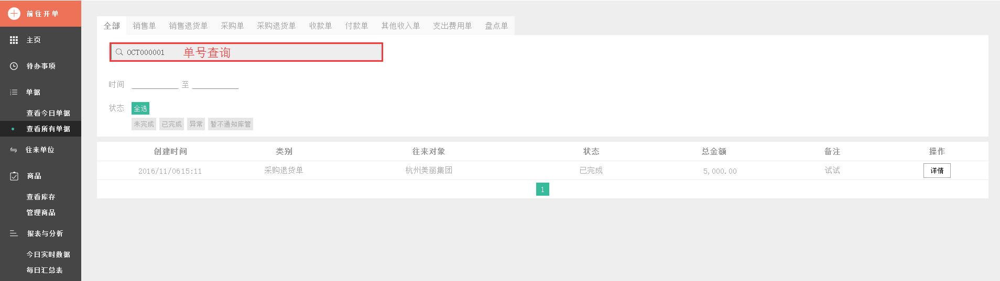
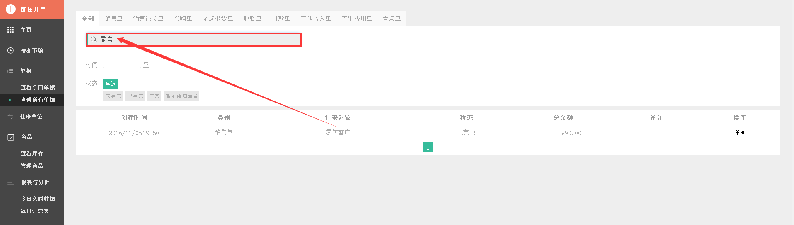
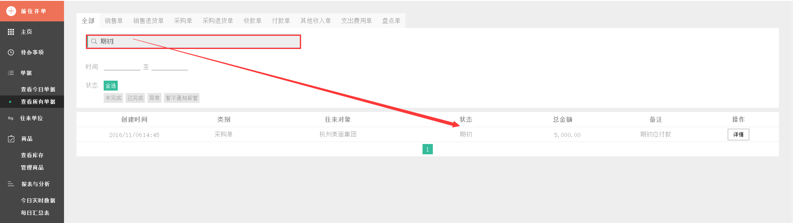

#6.2.2 查看所有单据
**可查看所有已开出单据的相关详细信息。**

    - 日期定位查询
	- 直接搜索单据
	- 根据单据类型筛选单据
	- 根据单据状态筛选单据

###.1 日期定位查询
> 可根据用户自身需求，查找相应日期区间的单据

#
###.2 直接搜索单据
>1、 如果您想要查看某一日交易的某一个单据，可点击页面左侧的`查看所有单据`进入到相应的页面中。

>2、可在搜索栏直接输入关键词（包括单号、往来对象、状态）来搜索相应的单据。

>3、以输入**单号**关键词为例，进行查找。

> 以输入**往来对象**关键词为例，进行查找。

> 以输入**状态**关键词为例，进行查找。

>4、点击`详情`，可查看到该单号的付款单详情。

>5、若单据状态在已完成、期初等，点击`☰`按钮可修改备注信息和查看该记录的日志。

>点击`修改`，修改备注。

>再次点击`完成修改`，才完成备注的修改。

>点击`查看日志`，查看该记录的日志。

>再次点击`查看日志`，可收起该记录的日志内容。
#
>再次点击`☰`,可收起`修改`和`查看日志`按钮。
#
>6、若单据状态是正在通知库管，点击`☰`按钮弹出标记为已完成、标记为异常、修改备注信息和查看该记录的日志。
>点击`标记为异常`按钮，可把单据状态改成异常状态(订单异常的原因有库存出错，不够出货；多发或少发货了等)。

>选择异常原因，理由可填可不填。

>点击`标记为已完成`按钮，可把单据状态改成已完成状态。

>其他操作详看步骤5。
#
>7、若单据状态是暂不通知库管，点击`☰`按钮弹出通知库存、标记为已完成、标记为异常、修改备注信息和查看该记录的日志。
>点击`通知库管`按钮，可把单据状态改成正在通知库管状态。

> 状态显示正在通知库管。

>其他操作详看步骤5、6。
#

>8、点击`×`，返回上一级。

# 
###.3 根据单据类型筛选单据
>可通过搜索栏上方的单据类型标签栏，直接选择不同类型的单据类型进行筛选，可与状态标签、时间定位结合使用。

# 
###.4 根据单据状态筛选单据
>可通过搜索栏下方的单据状态标签栏，直接选择不同状态的单据类型进行筛选，可与类型标签、时间定位结合使用。

