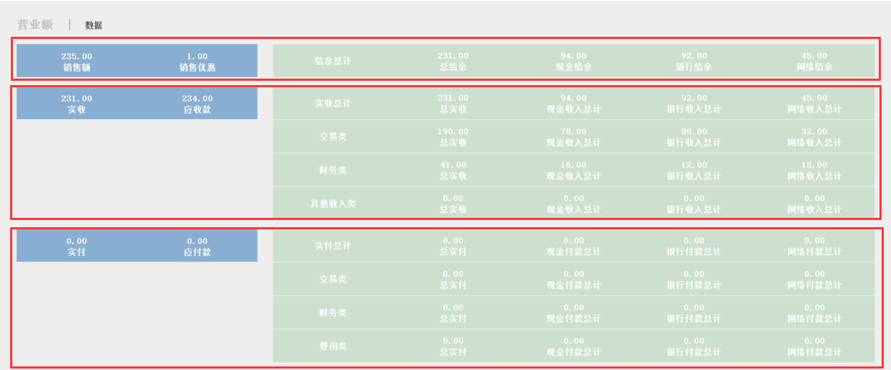
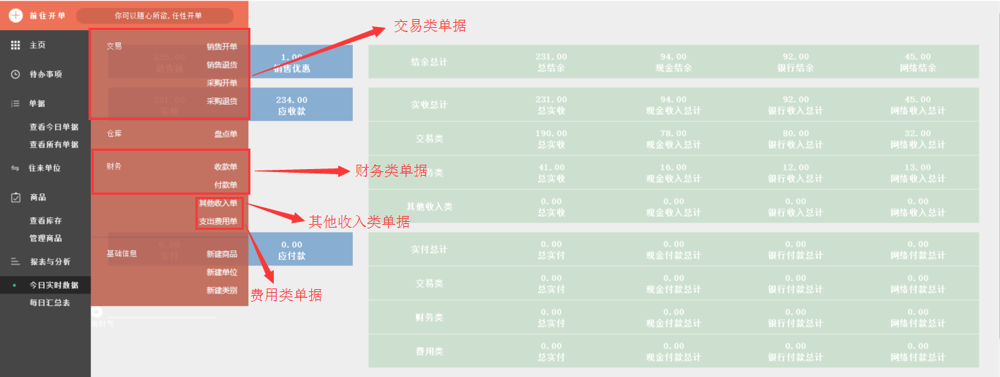
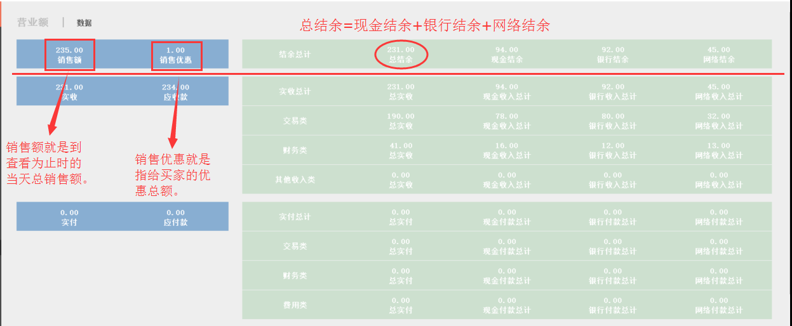
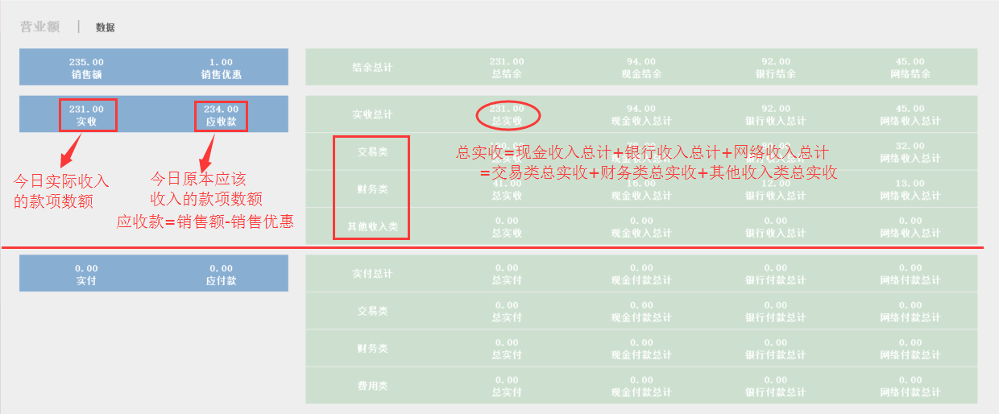
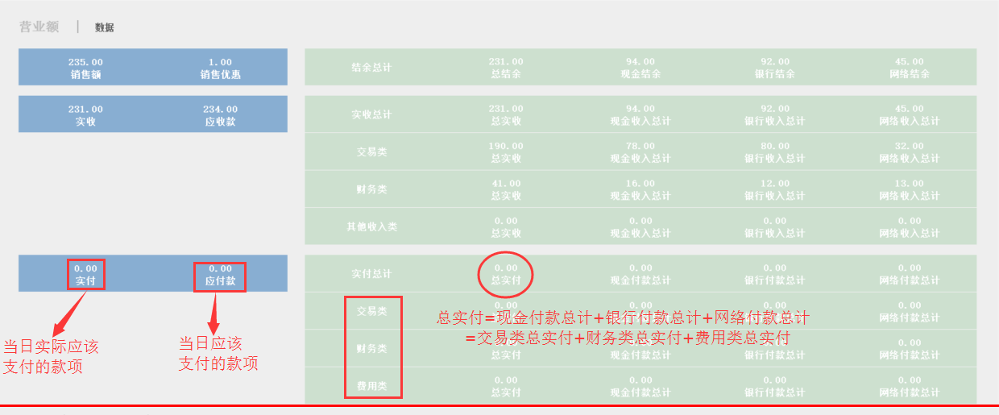
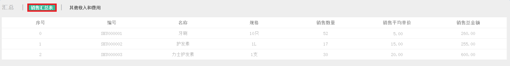
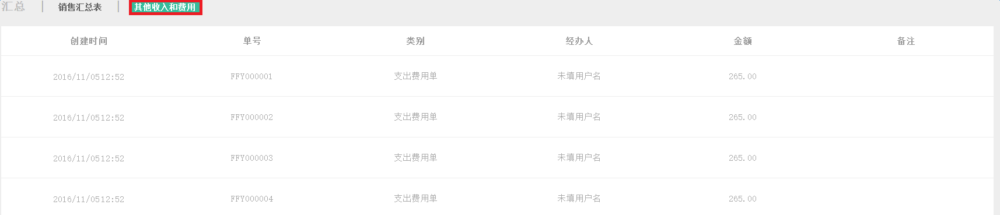

#6.4.1 今日实时数据
**可以查看今日实时的数据变动状况，掌握第一手资料。**

	- 营业额数据
	- 销售汇总表
	- 其他收入和费用

###营业额数据
> 可实时了解当日营业额的变化状况，第一手掌握今天的营业情况，并可及时根据数据改变策略。

 
> 交易类包括销售开单、销售退货、采购开单、采购退货；
# 

> 财务类包括收款单、付款单；
# 

> 其他类包括其他收入单、支出费用单。

> 总结余=现金结余+银行结余+网络结余

> 应收款=销售额-销售优惠；
# 

> 总实收=现金收入总计+银行收入总计+网络收入总计；
#  

> 总实收=交易类总实收+财务类总实收+其他收入类总实收。

>总实付=现金付款总计+银行付款总计+网络付款总计；
# 

>总实付=交易类总实付+财务类总实付+费用类总实付。

###销售汇总表
> 可实时了解今日销售状况明细，及时知道今日的销售之冠。

# 

###其他收入和费用
> 掌握一些细小的货币流入和流出，使您的账目更加明了。

