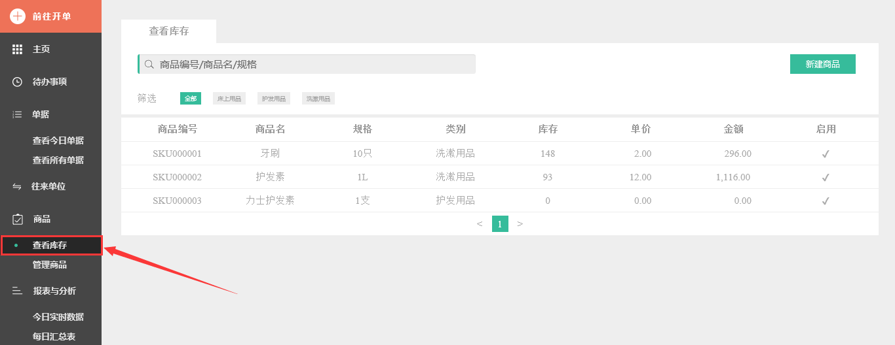
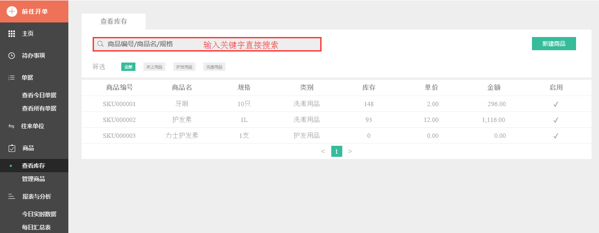
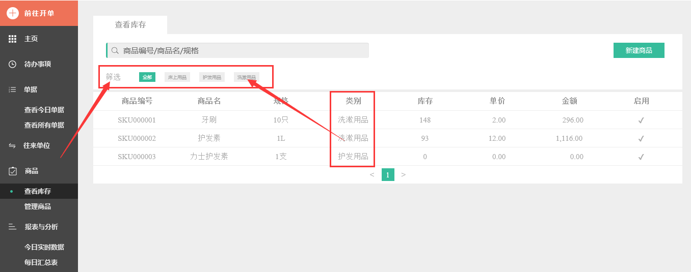
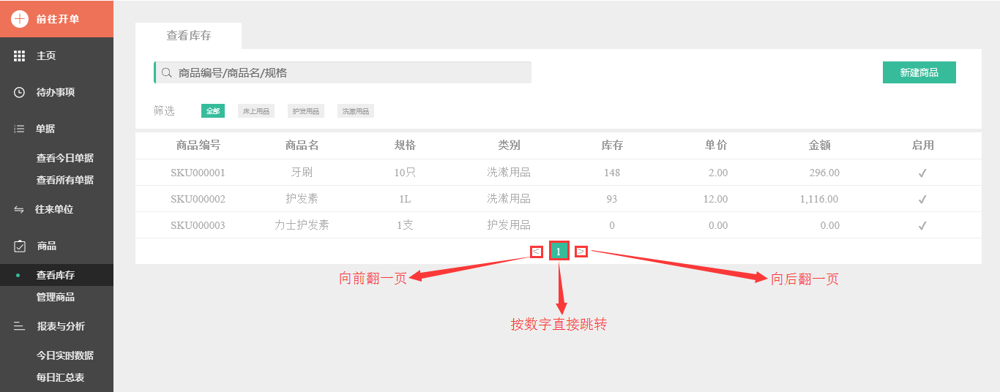

#6.3 查看库存
**SKU是指同款商品有多种规格，每个规格就是一个SKU，例如纺织品中一个SKU通常表示：规格、颜色、款式。可以在此查看库存状况。**

> 1、首先从左侧目录栏点击`查看库存`，进入页面。

> 2、在搜索栏输入关键字（商品编号、商品名、规格、速查码）搜索所想找的库存信息。

> 3、若通过搜索关键词得到的信息量还是过大，可通过筛选商品类别`标签`，过滤掉一些信息，从而使索搜到的信息更为精确。

> 4、点击`<`、`>`进行前后翻页或直接点击数字，进入到所想要取的页面。

