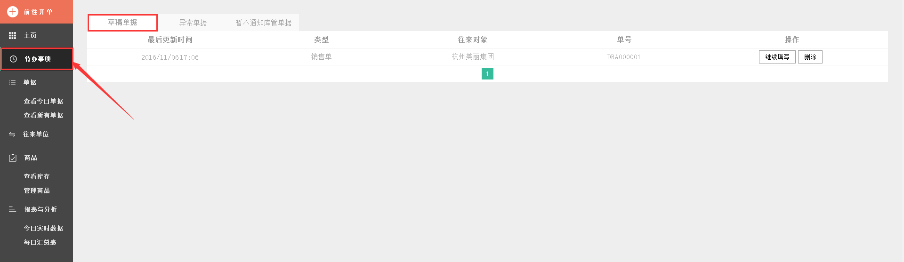
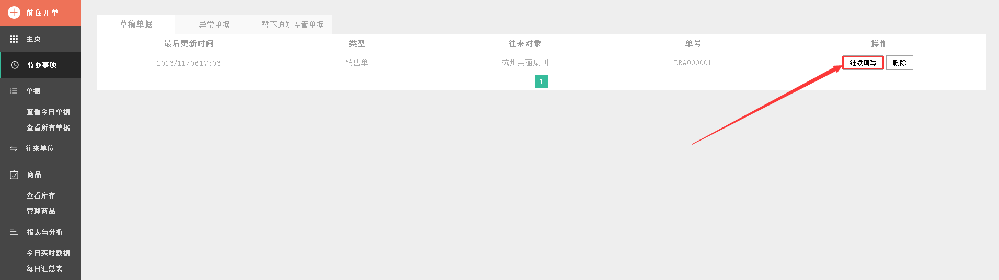
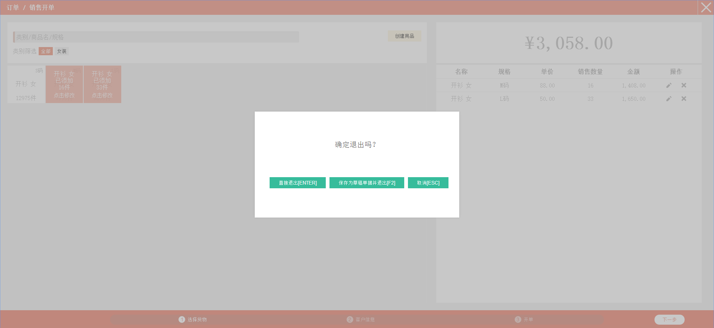
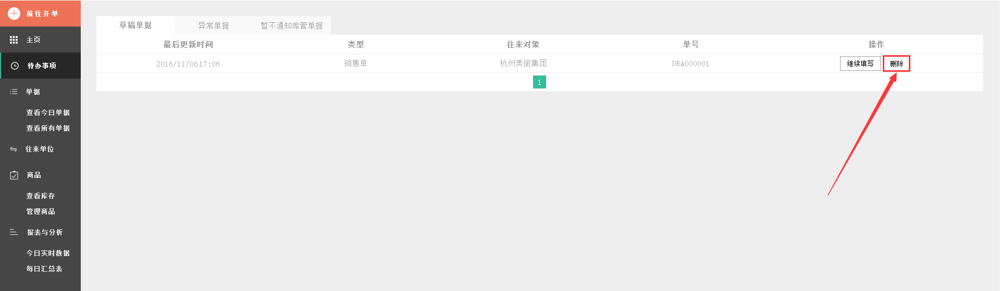
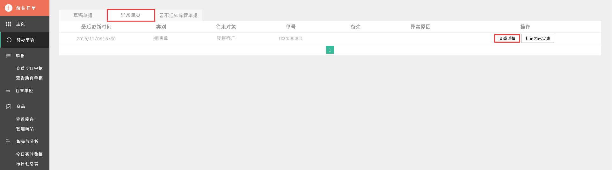
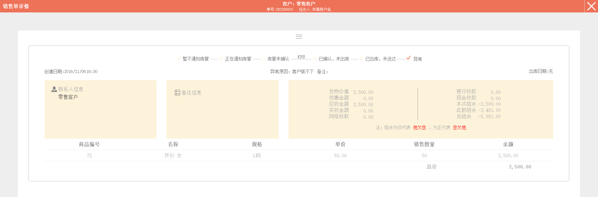
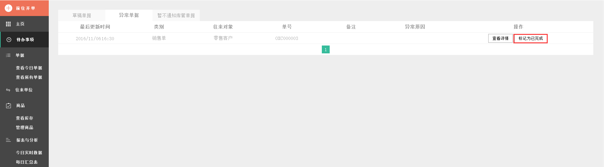
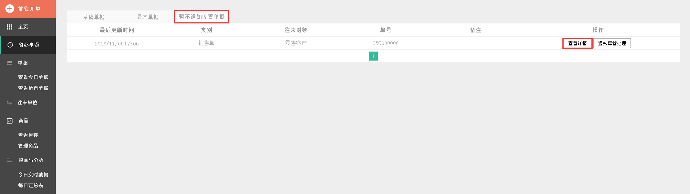
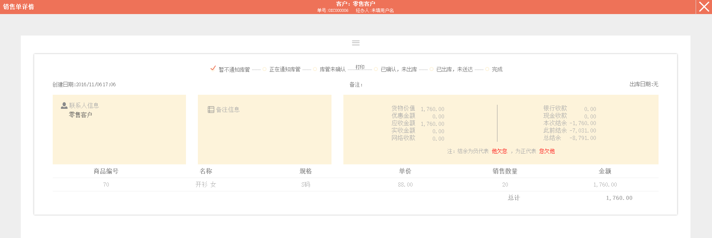

#6.1 待办事项
**那些中途退出而保存的单据，有问题而标识为异常的单据，选择暂时未通知库管的单据都可以在待办事项中查询到，并进行继续填写、删除单据等操作。**

	- 草稿单据
	- 异常单据
	- 暂不通知库管单据

###1 草稿单据
>1、 先前在开单过程中因某些因素导致中断并保存了的草稿单据在此处查找。

>2、点击页面右侧按钮`继续填写`，即可继续完成先前未完成的单据。

>3、若又有事导致要退出该界面，仍可选择保存为草稿单据并退出。

>4、若不再想要这可草稿单据，可直接按`删除`键。

# 
###2 异常单据
>1、在`单据`中，所标记的异常数据在此查找，可进行`查看详情`和`标记为已完成`操作，点击`查看详情`。

>可跳到销售单详情页。

>点击`☰`按钮弹出标记为已完成、标记为异常、修改备注信息和查看该记录的日志。
>点击`标记为异常`按钮，可把单据状态改成异常状态。

>选择异常原因，理由可填可不填。

> 编辑完成。

>点击`标记为已完成`按钮，可把单据状态改成已完成状态。

>点击`修改`，修改备注。

>再次点击`完成修改`，才完成备注的修改。

>点击`查看日志`，查看该记录的日志。

>再次点击`查看日志`，可收起该记录的日志内容。
#
>再次点击`☰`,可收起`修改`和`查看日志`按钮。

>2、点击`标记为已完成`，可直接把订单状态从异常转变成已完成。

# 
###3 暂不通知库管单据
>1、在`单据`中，所标记的暂不通知库管单据在此查找，可进行`查看详情`和`通知库管处理`操作，点击`查看详情`。

>可跳到销售单详情页。

>点击`☰`按钮弹出通知库存、标记为已完成、标记为异常、修改备注信息和查看该记录的日志。
>点击`通知库管`按钮，可把单据状态改成正在通知库管状态。

> 状态从暂不通知库管转变成正在通知库管状态。

>点击`标记为异常`按钮，可把单据状态改成异常状态。

>选择异常原因，理由可填可不填。

> 编辑完成。

>点击`标记为已完成`按钮，可把单据状态改成已完成状态。

>点击`修改`，修改备注。

>再次点击`完成修改`，才完成备注的修改。

>点击`查看日志`，查看该记录的日志。

>再次点击`查看日志`，可收起该记录的日志内容。
#
>再次点击`☰`,可收起`修改`和`查看日志`按钮。

>2、点击`标记为已完成`，可直接把订单状态暂不通知库管状态直接变成已完成。

# 