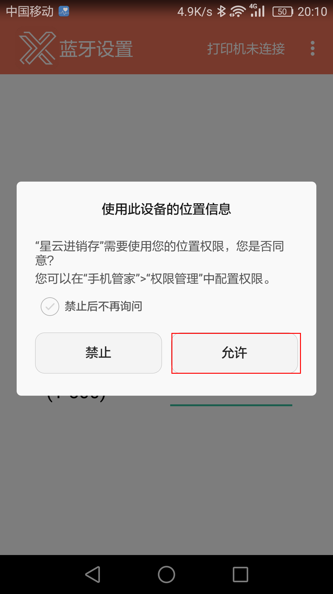
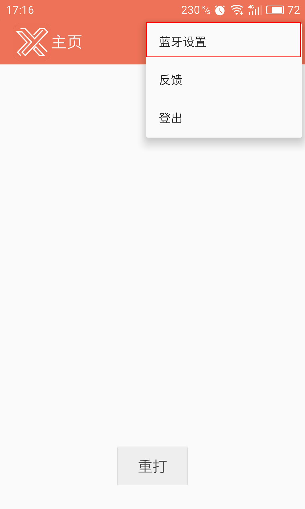
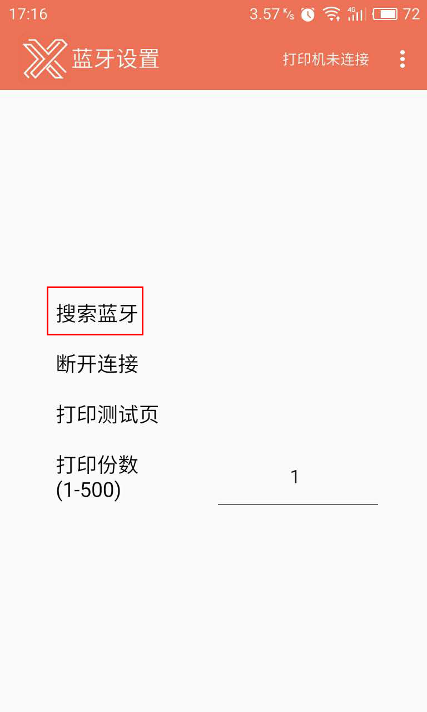
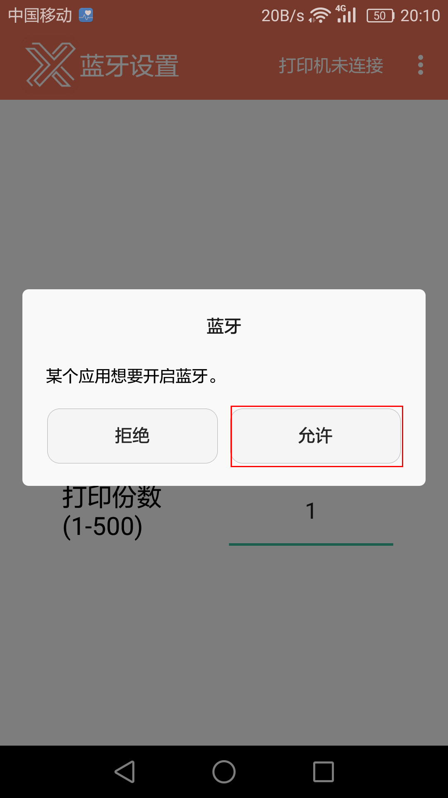
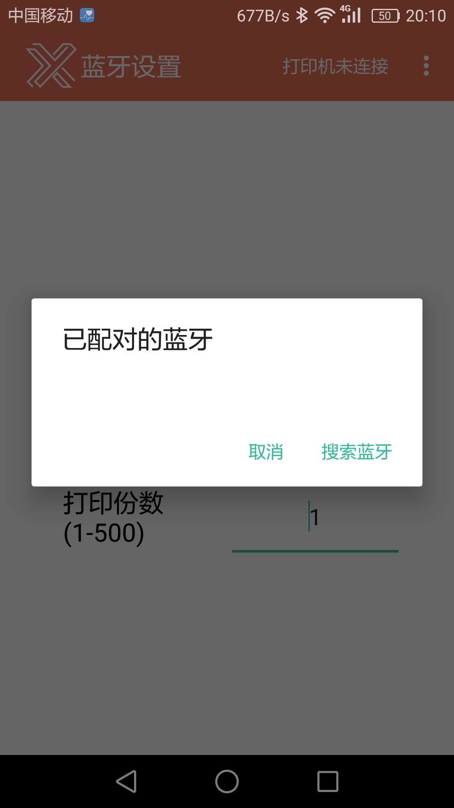
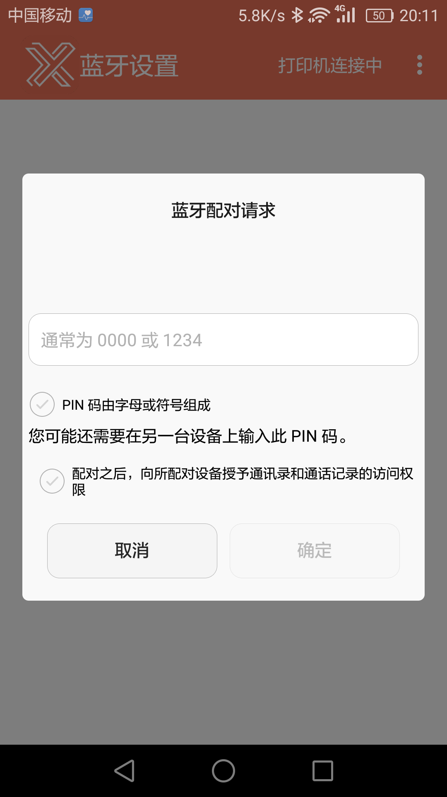
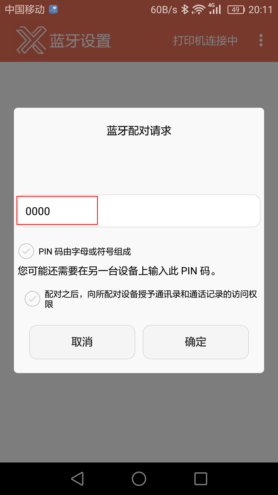
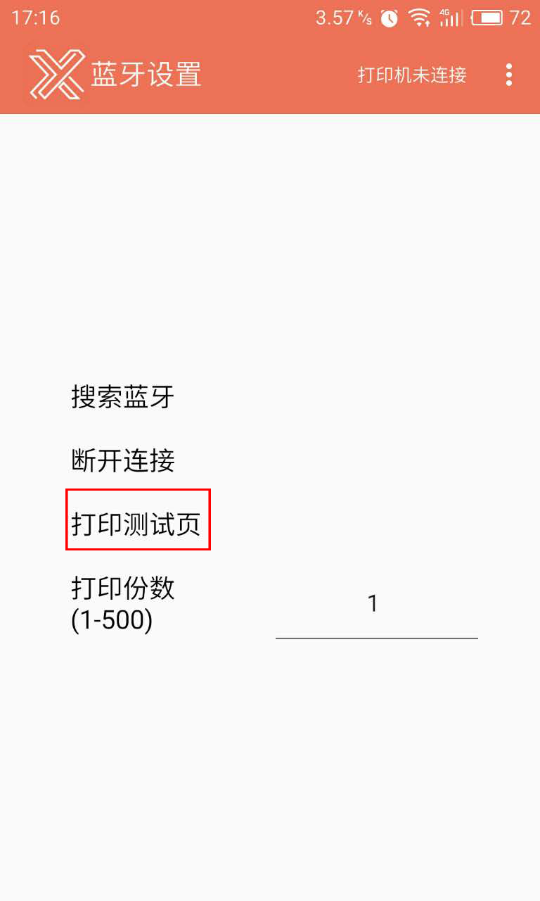
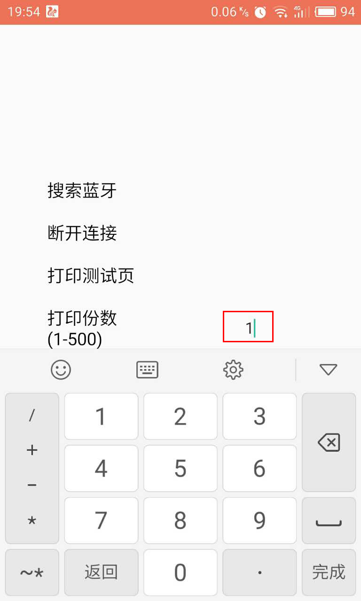
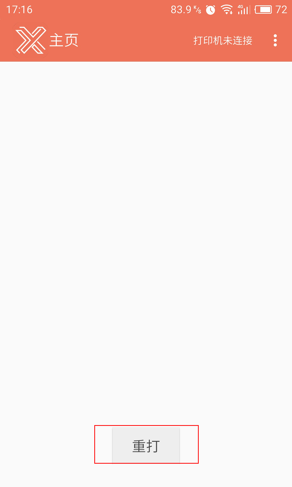

#2、打印机连接设置及使用
    - 打印机的连接
	- 打印方式

###2.1 打印机的连接
>1、进入主页后，因为需要寻找打印机及需要知道您的所在位置，需要您进行定位权限的设置，按`允许`，即权限设置成功。

>2、如果您是第一次使用，则您的打印机是未连接状态，此时上方左侧处提示您打印机未连接，这时候您需要去设置打印机的连接情况。仍然点击右上角的`┋`，有一个`蓝牙设置`

>3、点击`蓝牙搜索`，此时您需要保证您的手机的蓝牙是打开状态的。

>4、此时您的手机会提示您**有应用软件想要开启蓝牙**，不要惊慌，这是您在使用的星云进销存——库管手机端在申请您的许可，此时，您点击`允许`即可完成操作。

>5、然后手机就会自动进行搜索附近的蓝牙。

>6、显示出附近都有哪些蓝牙设备，此时您选择您的打印机设备即可。

>7、为了验证您是否连接上了正确的蓝牙设备，设置配对码。

>8、使用您的蓝牙设备，并输入您刚所设置的配对码。

>9、当您想要断开手机与打印机的连接时，可按`断开连接`，使手机与打印机的连接分离。

#
###2.2 打印方式
>1、在刚使打印机连接成功后，可以点击`打印测试页`进行测试。

>2、无需有任何操作，只要有开单，且状态为**立马通知库管状态**打印机就会自动打印相应单据。
#
>3、默认打印份数为1，先要更改打印份数，点击横线上的数字，更改成自己想要打的份数即可。

>4、若打印机没有工作，或想再次打印之前单据，可点击`重打`。

