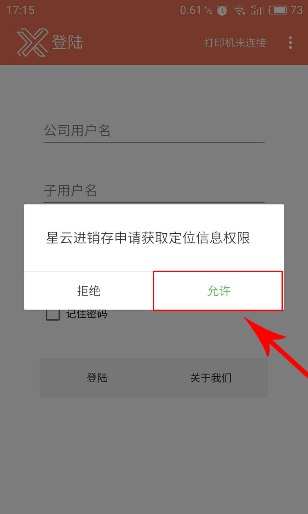
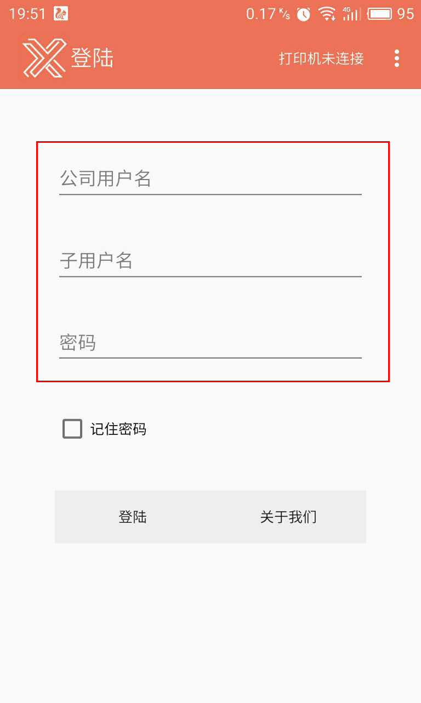
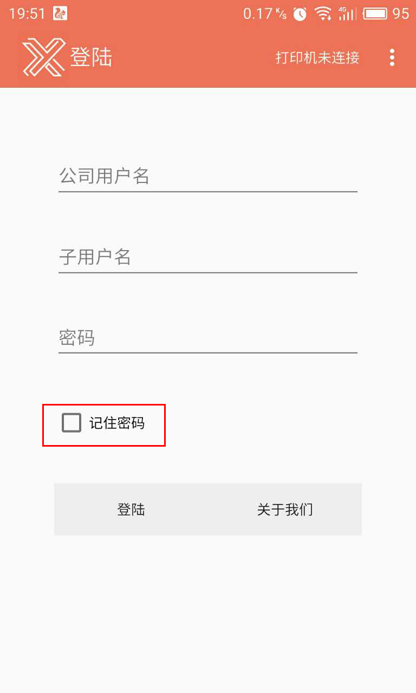
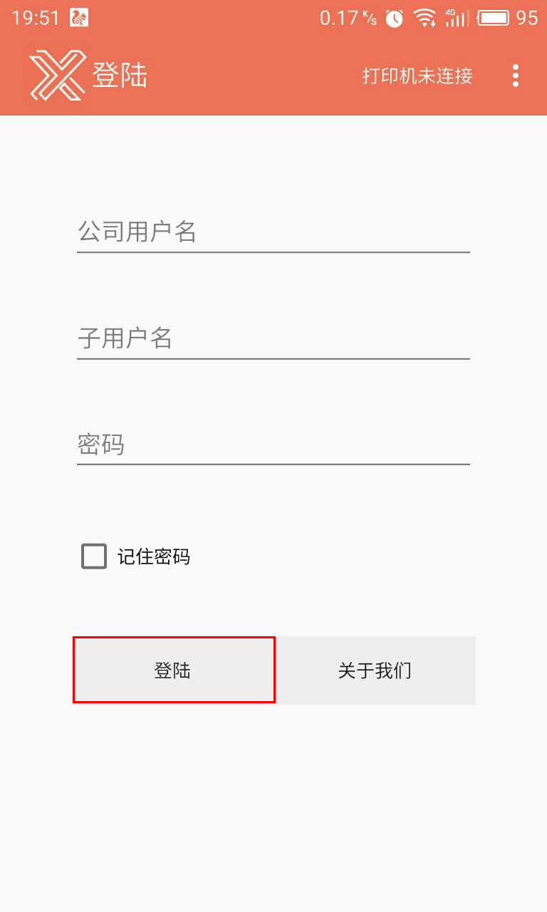
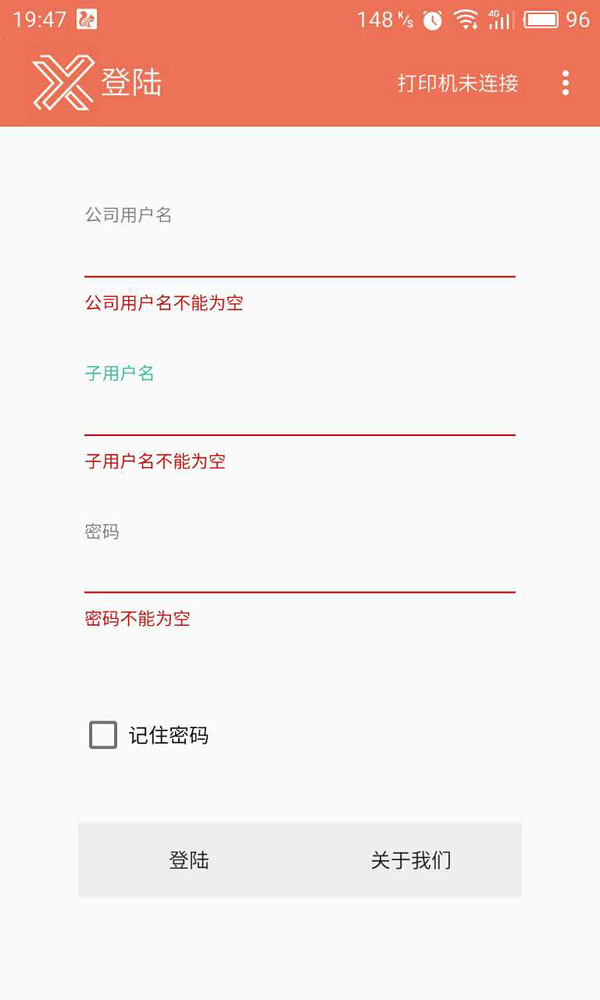
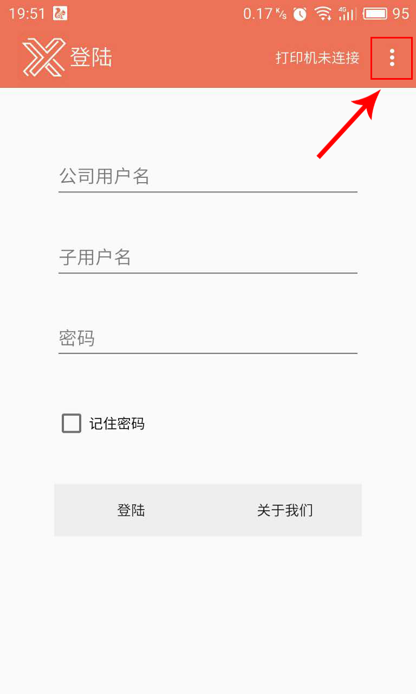
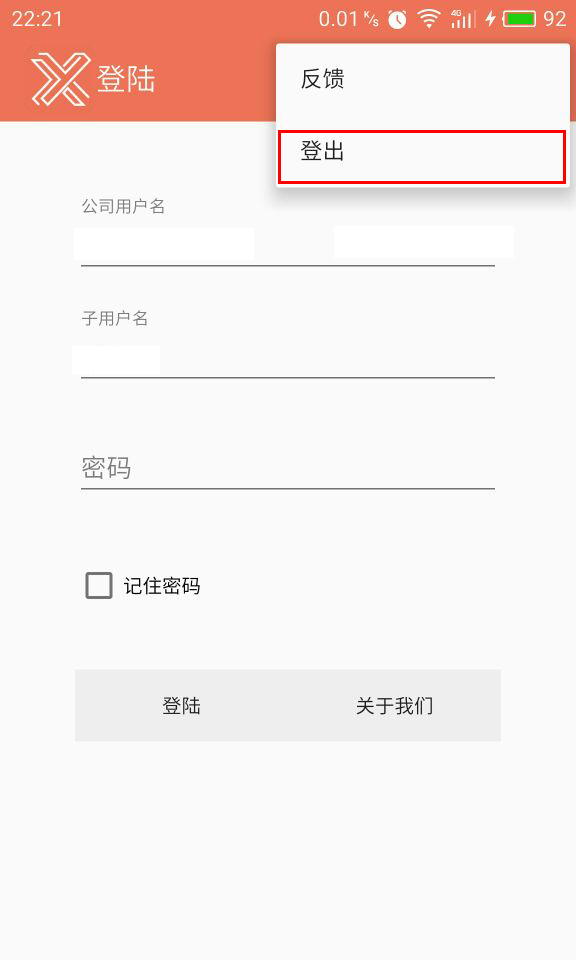

#1、登录/登出
    - 权限提示
	- 登录
	- 登出

###1.1 权限提示
> 用户进入库管手机端（安卓版）后，需要进行权限设置，按`允许`，即权限设置成功。

#
###1.2 登录
>1、在设置成功后，可进入登录页，需要填写相应的账户信息（注：子用户名只可填写贵公司库管的账户名）。

>2、若不想重复输入密码，可勾选`记住密码`，就不用重复输入密码了。

>3、信息及密码输入无误后，点击`登录` ，即可登录成功。

>4、相应账户信息不能为空，出现漏填之类的现象，系统会自动提示您。

# 
###1.3 登出
>1、点击页面左上角`┋`，即可看到`登出`键。

>1、点击`登出`,即退出了可操作界面。

